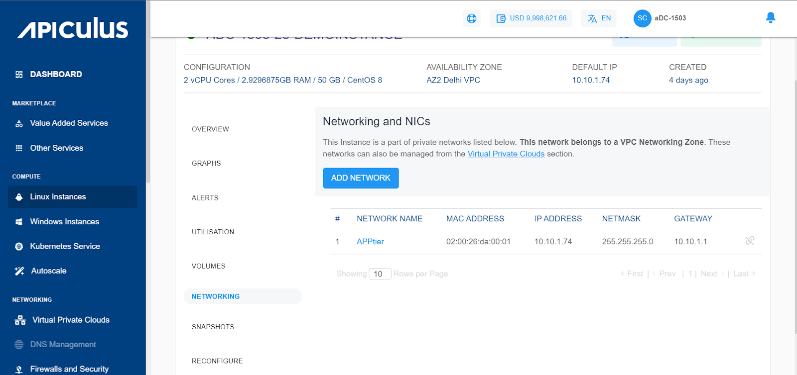

# Networking Management with Linux Instances

From [Operating Linux Instances](AboutLinuxInstances), navigate into a Linux Instance and access the **Networking** tab to see the networks that this Instance is attached to.

The Networking and NICs section will list all the networks that a Linux Instance is attached to.

The following actions are available:

- If the Instance is inside a VPC, you can associate the Instance to multiple tiers within the VPC or share the Instance with other VPC networks in the same Availability Zone by using the **ADD NETWORK** option.
- Network/tier associations can be removed from this section by using the _unlink_ action.
- If the Instance is in a Basic/Flat Networking AZ, you'll see the NIC details. Presently, only one NIC is supported on Basic/Flat Networking Instances.

:::note
Advanced networking configurations can be done using the [Virtual Private Clouds](/docs/Subscribers/Networking/VirtualPrivateClouds/AboutVirtualPrivateClouds) service.
:::
