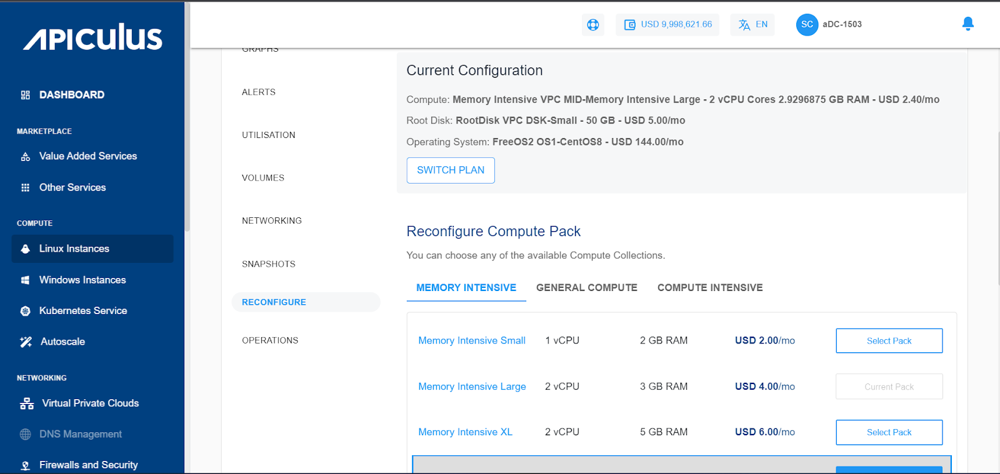
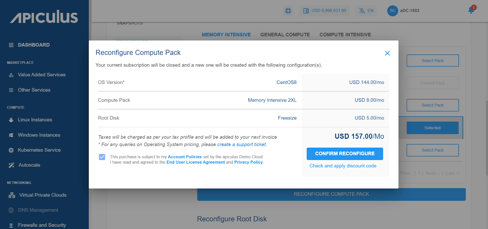

# Reconfiguring Linux Instances

From [Operating Linux Instances](https://docs.apiculus.com/hc/en-in/articles/12794520211357), navigate into a Linux Instance and access the **Reconfigure** tab to see available reconfiguration options.

A Linux Instance on Apiculus can be reconfigured in 3 ways:

1. Billing interval changed between monthly and hourly.
2. Choosing and applying a new Compute pack.
3. Choosing and applying a new Root Disk pack.

:::note
You can only reconfigure with the same billing interval. If you wish just to change the billing interval, please use the Switch Plan button. We recommend switching the plan first before reconfiguring the Instance if you wish to use both the Reconfigure and Switch Plan options. You will be charged as per the pack you have reconfigured, not based on the older pack.
:::