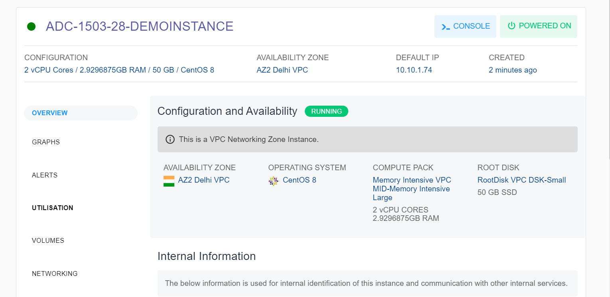

# Viewing Details of Linux Instances

From [Operating Linux Instances](AboutLinuxInstances), navigate into a Linux Instance and access the **Overview** tab to see its details.

1. Configuration and Availability
    1. The instance's status, **RUNNING**, is displayed in Green, whereas STOPPED is displayed in greyed out.
    2. Information about the networking zone, whether it is a VPC networking zone or a Basic/Flat/EC networking zone.

2. Internal Information- This displays the information that is used for internal identification of this instance and communication with other internal services.
    a. Template Name
    b. Internal Name
    c. Created On

3. Security and Access Control- Depending on the networking zone, the information and operations will be available here.
4.  If it's a VPC Networking zone, then the below information will be shown:
	1. Network Name
	2. VPC Name
	3. Access Control

5. If it’s a Basic/Flat EC networking zone, then the following information will be shown:
	1. Default Guest Network
	2. MAC Address
	3. IP Address
	4. Netmask
	5. Gateway