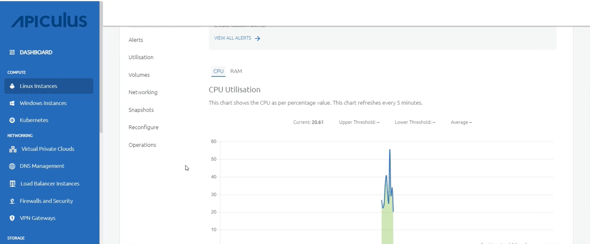

# Viewing Graphs and Utilization of Linux Instances

## Graphs (Real-time)

From [Operating Linux Instances](https://docs.apiculus.com/hc/en-in/articles/12794520211357), navigate into a Linux Instance and access the **Graphs** tab to see the available graphs and monitor this instance in real-time.

You can use these graphs to understand Instance utilisation patterns and create custom alerts.

The following graphs are available on a 24-hour time-scale graph with a 30-day trend line for the following parameters:

1. _CPU utilisation._
2. _RAM utilisation._
3. _Network Input._
4. _Network Output._

_

## Utilisation (Historical)

_From [Operating Linux Instances](https://docs.apiculus.com/hc/en-in/articles/12794520211357), navigate into a Linux Instance and access the **Utilisation** tab to view historical usage across supported parameters.  

The Utillisation table shows a historical date-wise details of daily maximum, minimum, and average readings for all parameters. The utilisation report is downloadable as a _.csv_ file. 