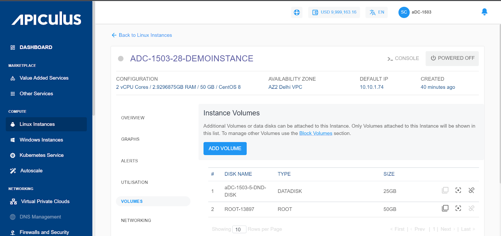

# Volume Management with Linux Instances

From [Operating Linux Instances](https://docs.apiculus.com/hc/en-in/articles/12794520211357), navigate into a Linux Instance and access the **Volumes** tab to see the disks attached to this Instance.

Linux Instances on Apiculus work with the [Block Volumes Service](https://docs.apiculus.com/hc/en-in/articles/13232676912797) and let you carry out basic disk operations.

There are three quick actions available i.e.,

1. **_Create Template_** - Click on it, and enter the image name and description.
2. **_Create Snapshot_** - Clicking on this will create a Volume snapshot.
3. **_Detach/attach_** - This will attach/detach the volume to/from the instance.

_Volume-level operations are available as part of the Block Volumes service._