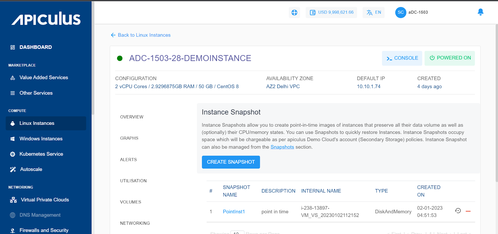
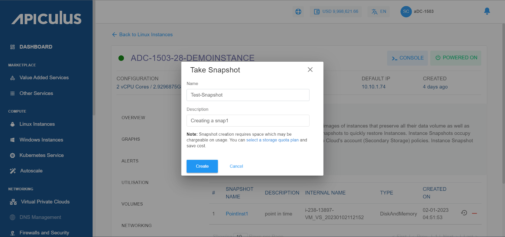

# Working with Linux Instance Snapshots

From [Operating Linux Instances](AboutLinuxInstances), navigate into a Linux Instance and access the **Snapshots** tab to see all the snapshots taken for this Instance.

Instance Snapshots allow you to create point-in-time images of instances that preserve all their data volume as well as (optionally) their CPU/memory states. You can use Snapshots to quickly restore Instances.

The Snapshots section shows all Linux Instance snapshots, which can be used to revert the Linux Instances to an earlier state.

Snapshot will list down the following details:

- Snapshot Name
- Description
- Internal Name
- Type
- Created On

Two quick options are available, one is to revert the Instance from the snapshot, and the other is to delete the particular snapshot.

To create a snapshot, please click on the **CREATE SNAPSHOT** button and it will ask you for the name of the snapshot and the description of the snapshot click on create the snapshot will be created, and if you click on cancel the action will be canceled.

