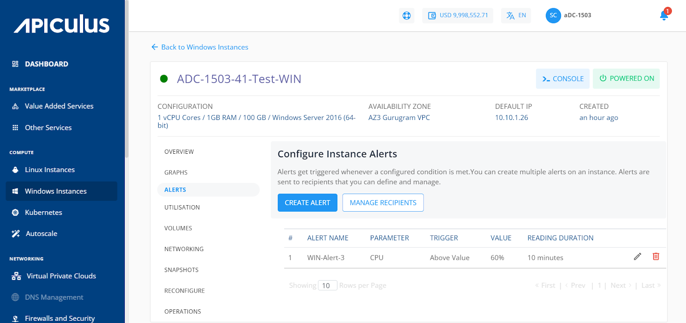
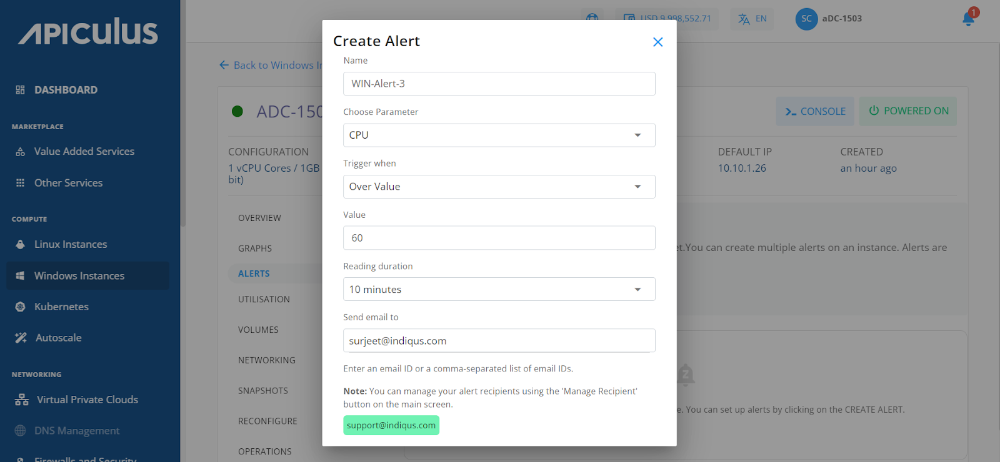
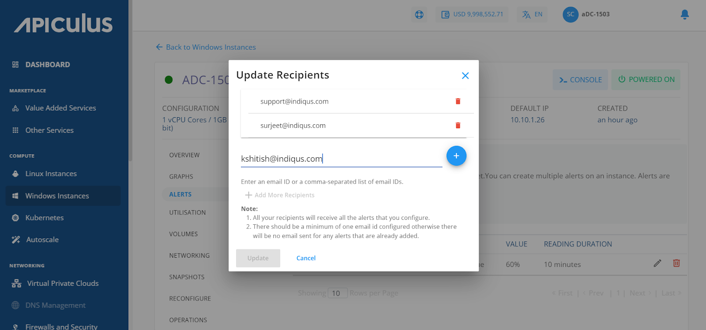

# Configuring Alerts on Windows Instances

From [Operating Windows Instances](AboutWindowsInstances), navigate into a Windows Instance and access the **Alerts** tab to view the configured alerts or configure new ones.

Alerts get triggered whenever a configured condition is met. You can create multiple alerts on an instance. Alerts are sent to recipients that you can define and manage.

Subscribers can configure alerts for instances running on the Apiculus. Subscribers can define alerts for Instances and configure the email recipients for these alerts using a straightforward and easy-to-use interface.

# Instance Alerts

The Alerts tab can be accessed from the instances details. It will list all the alerts already configured for that particular VM. In addition, it will show the details, i.e., ID, the name for the alert, Parameter, Trigger When, Value, and Reading Duration.

# Adding an Alert

Subscribers can create or add alerts simply by clicking on the **Add Alert** button. The following screen will open up, and the subscriber needs to describe the details of the alert.

The various fields of the add alert page are described below:

- Name- You can define the name for your alert.
- Choose parameter - This option will allow you to define what parameter needs to be monitored to trigger the alert email. Apiculus Cloud supports CPU, RAM, Disk, 1-min Load Average, 5- min Load Average, 15- min Load Average parameter_s.
- Trigger when - This set of options lets you define whether to trigger above or below a custom value.
- Value – You can define the Value. 
- Reading duration - This option lets you define the breach window, i.e., the duration for which the breach has to be consistent to trigger the alert email.
- Send alert to -Email ids can be added here, or also you can add them by using the configure recipients 

- 1-min Load Average - How many processes were active, executed, or awaiting execution at the last minute.
- 5-min Load Average - How many processes were active, executed, or awaiting execution in the last five minutes.
- 15-min Load Average - How many processes were active, executed, or awaiting execution in the last fifteen minutes.

# Configuring Recipients

This will list and display all the email IDs already configured for the alerts. You can delete the existing ids and add other email ids by following the steps below.

1. Click on the **Configure Recipients** button.
2. Click on **+ Add More Recipients**.
3. Add the email ids; multiple ids can be added and separated by (Comma).
4. Click on the **+** icon.
5. Then click on the **Update** button, and update the recipient's list.

:::note
All the recipients configured will receive all the setup alerts. If no email ID is configured or added, then no email will be sent for the already configured alerts.
:::