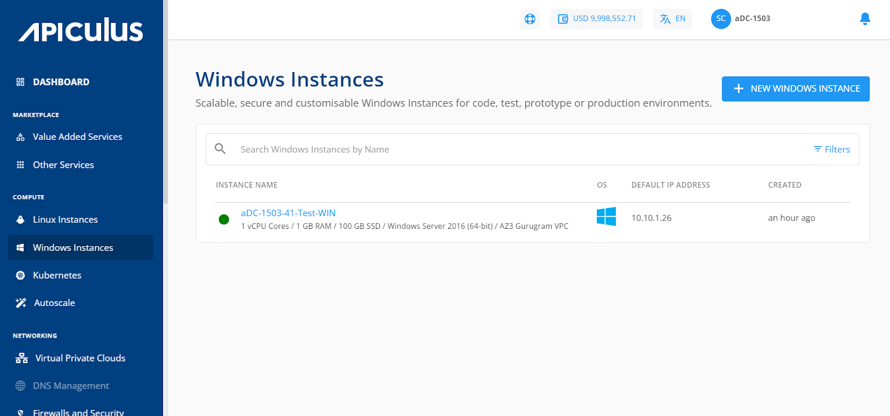

# Overview

Instances are computing units that provide you with resources to run your applications/workloads. Windows Instances are virtual machines that run the images of Windows Operating Systems.

Before purchasing a Windows Instance, it is important to plan the architecture, networking, and access to the Windows Instances. As a thumb rule:

- You can use a ‘Basic/Flat’ (or EC, elastic compute) Windows Instance to get started quickly and set up your Windows Instances behind apiculus Cloud’s global server load balancer (GSLB) and control access by setting up virtual firewall rules; or;
- You can use a ‘tiered’ network (or Advanced VPC, virtual private cloud) Windows Instances to configure advanced networking and application architectures and control access by setting up access control lists.

Apiculus offers a highly usable and visual way of working with and operating Windows Instances using the CloudConsole. All Linux Instances available in your account can be accessed in the following way:

1. Navigate to **Compute > Windows Instances**
2. All the Windows Instances for your account will be listed here with the following details
    1. _Instance Name (Along with the configuration details)_
    2. _OS- Icon will be displayed._
    3. _Default IP Address_
    4. _Created_

Clicking on the Instance name, you can view a list of sections and the various operations or actions you can perform by going inside the particular section. Below the Instance name, there is an informational view where you can find the below details

- _Configuration_
- _Availability Zone_
- _Default IP_
- _Created_ 

On the top right corner, two quick options are available, one for accessing the Instance console Instance and the other to POWER OFF/ON the instance.

---

Details on available Windows Instance operations and actions can be found in their respective sections.

- [Overview](https://docs.apiculus.com/hc/en-in/articles/13280387988253)
- [Graphs & Utilisation](https://docs.apiculus.com/hc/en-in/articles/13280453237277)
- [Alerts](https://docs.apiculus.com/hc/en-in/articles/13280520372253)
- [Volumes](https://docs.apiculus.com/hc/en-in/articles/13280580006045)
- [Networking](https://docs.apiculus.com/hc/en-in/articles/13280684988061)
- [Snapshots](https://docs.apiculus.com/hc/en-in/articles/13280721160221)
- [Reconfigure](https://docs.apiculus.com/hc/en-in/articles/13280753351709)
- [Operations](https://docs.apiculus.com/hc/en-in/articles/13280760095389)