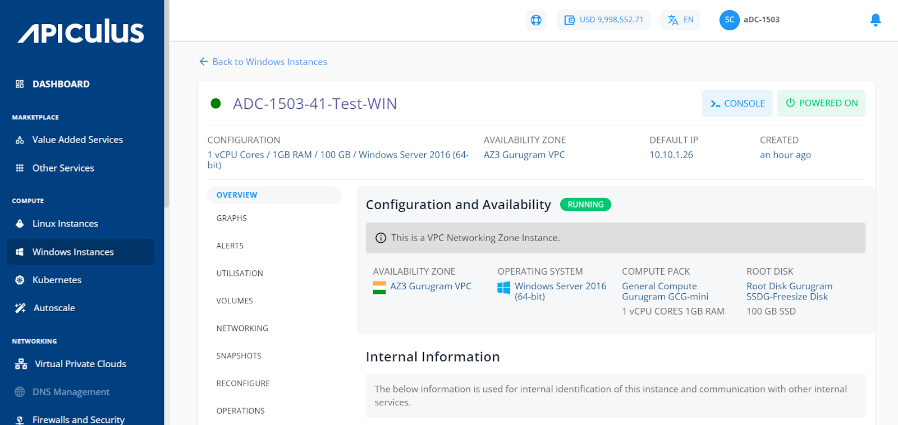
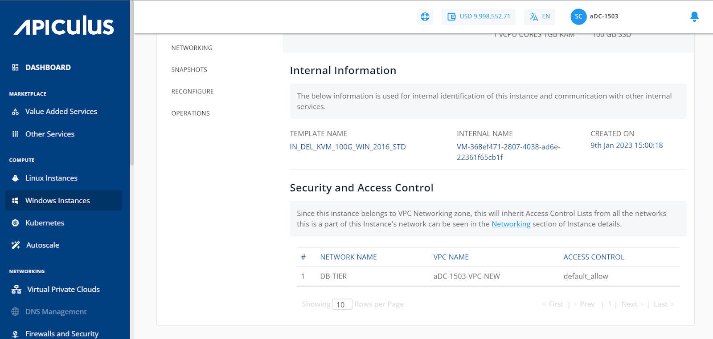
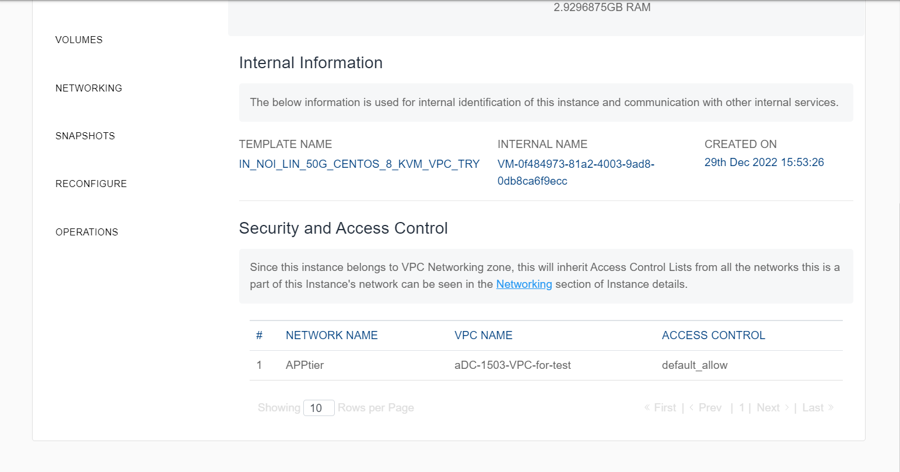

# Viewing Details of Windows Instances

From [Operating Windows Instances](https://docs.apiculus.com/hc/en-in/articles/13280072414749), navigate into a Windows Instance and access the **Overview** tab to see its details.

1. Configuration and Availability
    1. The instance's status, **RUNNING**, is displayed in Green, whereas **STOPPED** is displayed in greyed out.
    2. Information about the networking zone, whether it is a VPC networking zone or a Basic/Flat/EC networking zone.

2. Internal Information- This displays the information that is used for internal identification of this instance and communication with other internal services.
    1. _Template Name_
    2. _Internal Name_
    3. _Created On_

3. Security and Access Control- Depending on the networking zone, the information and operations will be available here.
4.  If it's a VPC Networking zone, then the below information will be shown
    1. _Network Name_
    2. _VPC Name_
    3. _Access Control_

5. If it’s a Basic/Flat EC networking zone, then the following information will be shown.
    1. Default Guest Network
    2. MAC Address
    3. IP Address
    4. Netmask
    5. Gateway