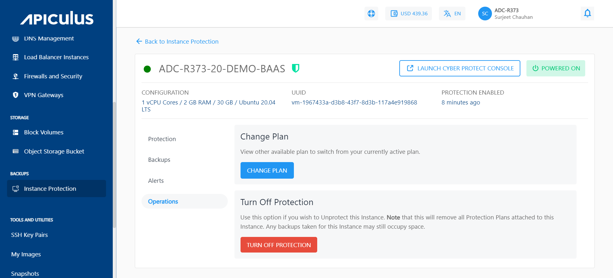
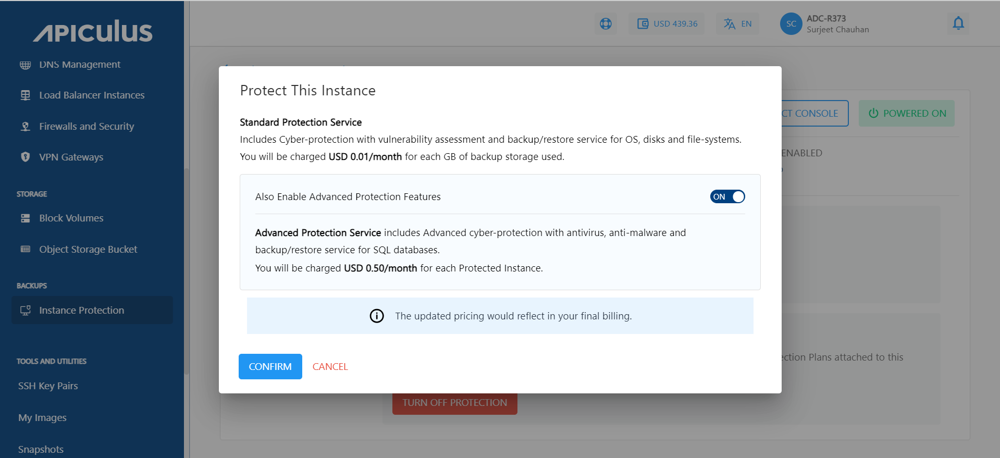

# Changing the Protection Plan

Suppose you want to switch your current plan to a different one. This can be achieved as follows:

1. Navigate to the _Instance Protection_ Under _Backups_ and click on the particular instance.
2. Navigate to the _Operations_ section and click on the _Change Plan_ button.

3. According to your current plan, you can opt for advanced protection features or, disable these advanced features accordingly.

The change plan can also be made by navigating to the Protection section of a particular Instance.