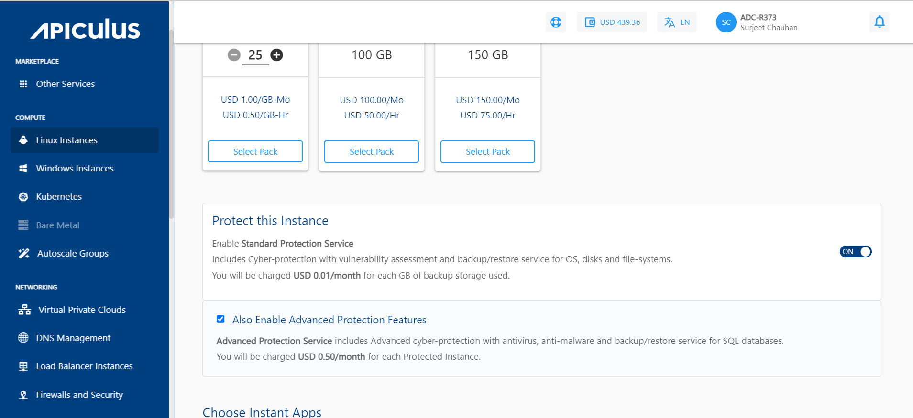
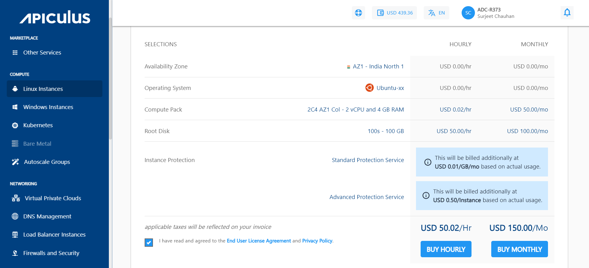
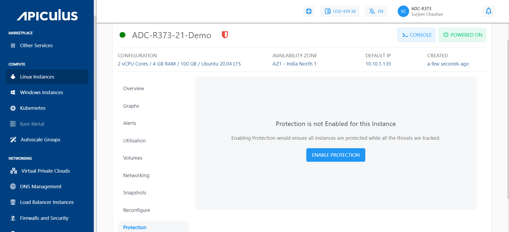
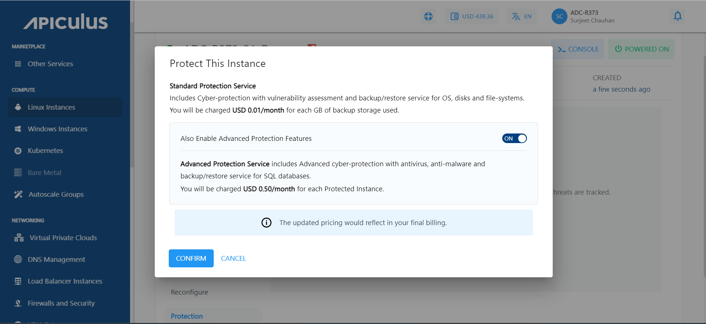

# Enabling Instance Protection

Instance Protection service can be enabled in two ways.

**During Instance Creation**

1. Follow the steps to create a [Linux](/docs/Subscribers/Compute/LinuxInstances/CreatingLinuxInstances) or a [Windows](/docs/Subscribers/Compute/WindowsInstances/CreatingWindowsInstances) instance.
2. You have to enable the _Protect this Instance_ switch. There, you will get a _Standard Protection Service_, and you can also opt for _Advance Protection Features_. 

  3. The pricing summary will be reflected as per the selection.

**After Instance Creation**

If you already have a Linux or Windows Instance and didn't enable the protection service while creating the instance, you can do it later. Navigate to the Listing of the Linux/Windows Instances. Click on the particular instance. Follow the below steps to activate the protection plan service.

1. Inside the instance listing, find the **Protection** section and click on the **ENABLE PROTECTION** button.

   2.  Click on Confirm, and if you want to enable the advanced protection features, then enable the switch as shown in the below screenshot:

 3. After the confirmation, the steps for the activation will be listed, and these steps need to be run through the command line. Once the instructions mentioned have been performed, the particular instance will be protected, and the details will be listed in the  **Instance Protection** menu.

:::note
The list of supported operating systems and environments can be viewed at the following link:
https://www.acronis.com/en-us/support/documentation/AcronisCyberProtect_15/index.html#cshid=36983
:::