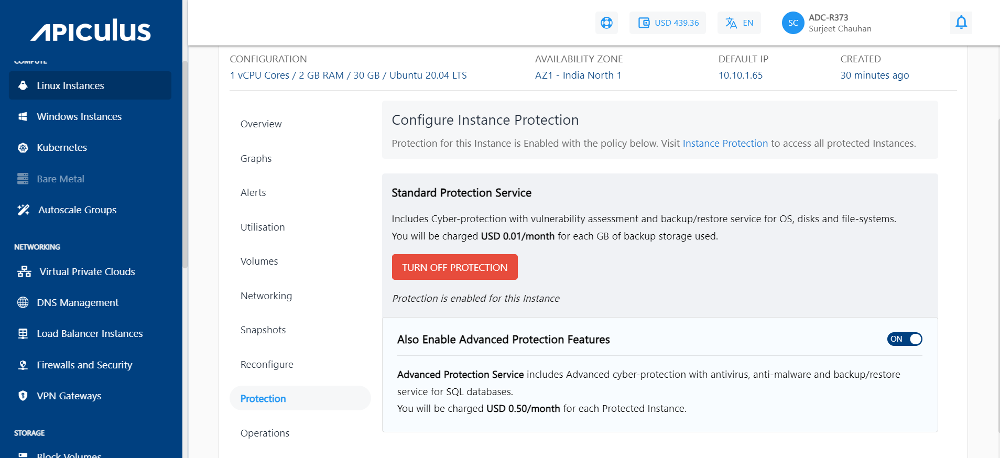
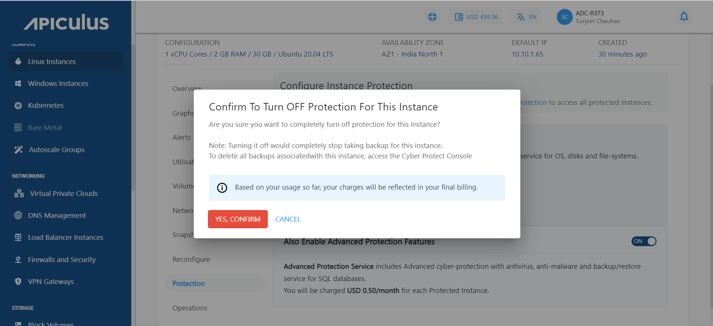
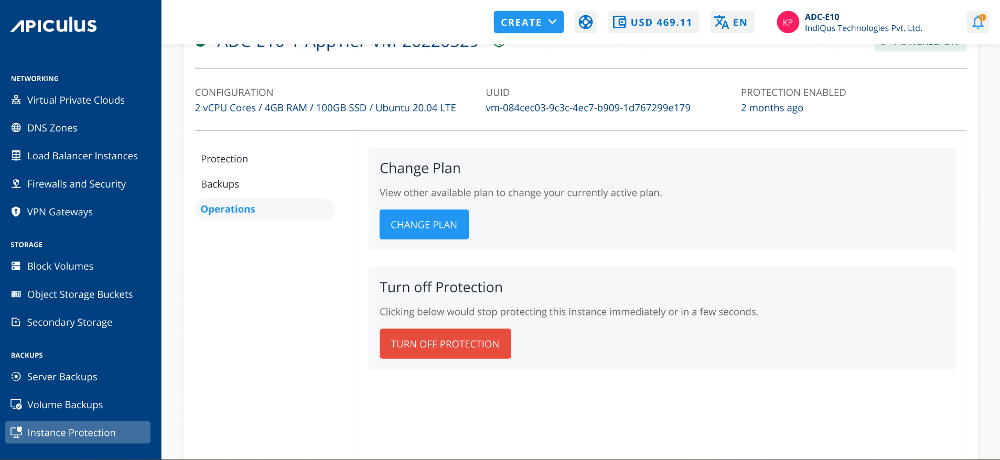
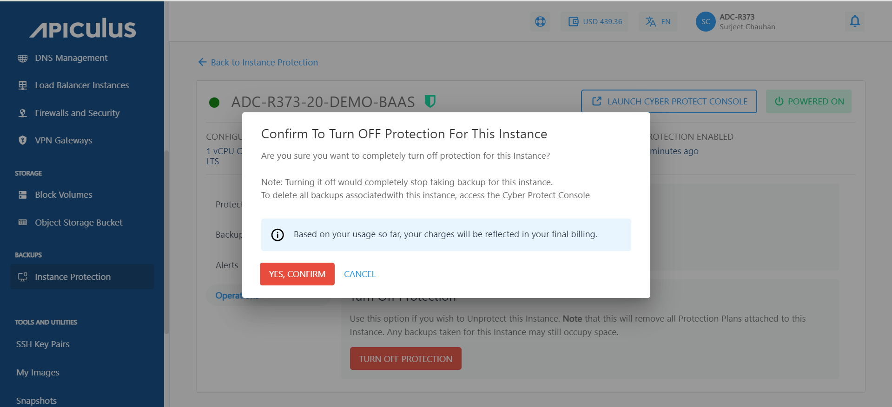

# Turning off the Protection Plan

Protection can be turned off in two ways. The first one is as follows:

-  To turn off the protection plan, click on the **TURN OFF PROTECTION** button inside the protection section of a particular instance and click confirm.

- Click on **YES, CONFIRM** button, and the protection will be turned off for this particular instance.

The other way is mentioned as follows:

- Navigate to the _Instance Protection_ Under _Backups_ and click on the particular instance.
- Navigate to the _Operations_ section and click on _Turn off_ _Protection_.

- Click on _YES, CONFIRM_ button, and the protection will be turned off for this particular instance.

