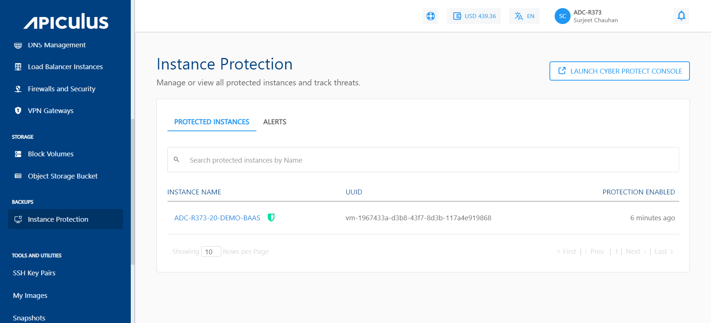
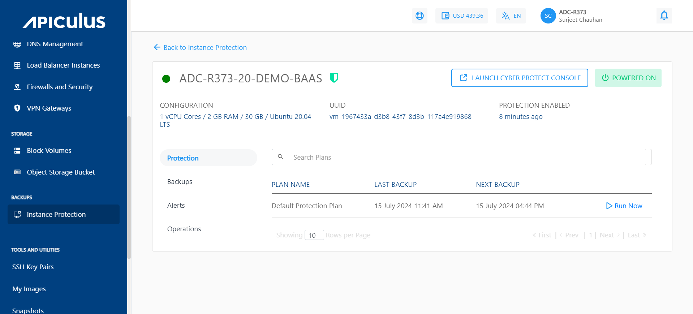
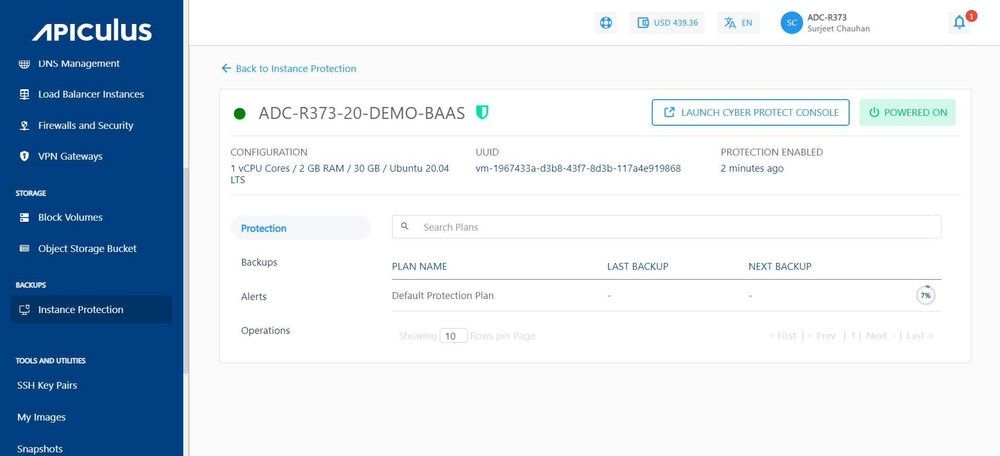
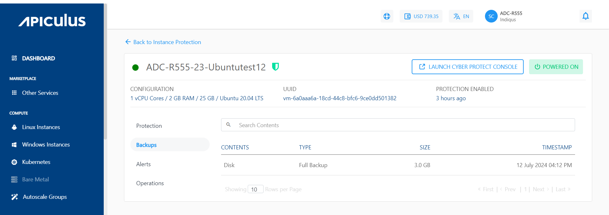

# Viewing Protected Instances

1. Select the **Instance Protection** option under the **Backups** menu in the main navigation menu.
2. Click on **Protected Instances** to display a list of all protected instances.

3. Select a specific instance name to view the following options:
    - **Protection**
    - **Backups**
    - **Operations**
4. Protection will list when the last backup was taken and when the upcoming backup is scheduled.

5. Also, you get the option to **Run Now**. Clicking on it will start taking the backup.
6. The backups section will display all the available backups. To restore a backup, click the **LAUNCH CYBER PROTECT CONSOLE** above.

