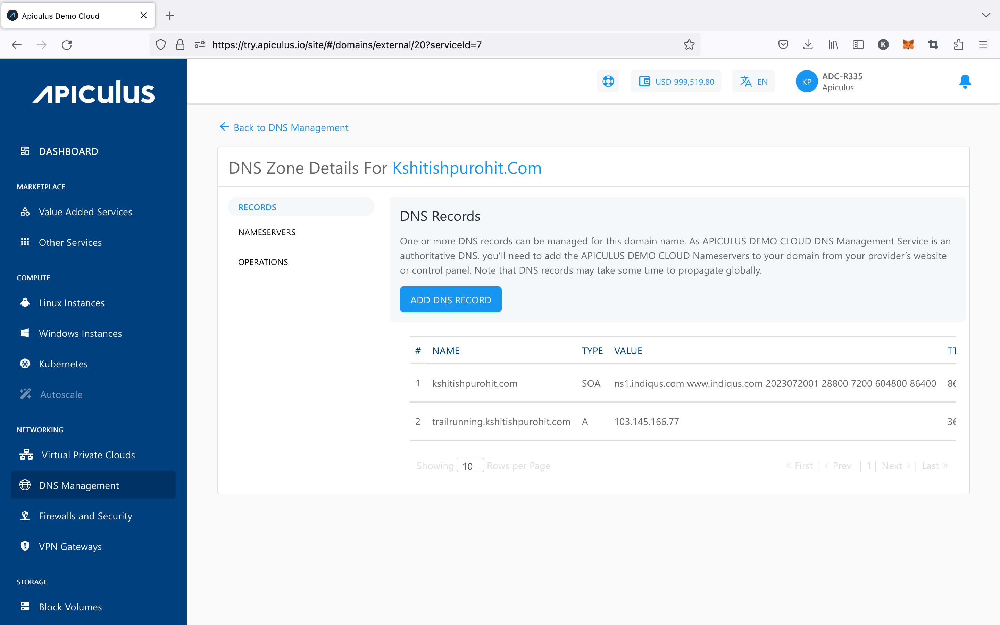
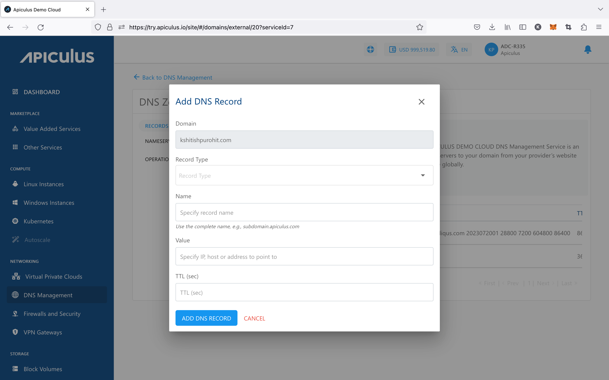

# Managing DNS Records

DNS records and subdomains can be managed on Apiculus CloudConsole to be used with Instances, IPv4 Addresses and other workloads created on Apiculus-powered clouds. This only requires a [domain to be linked with the Apiculus nameservers](LinkingDomainstoApiculusCloudConsole).

DNS records can be viewed and managed for all linked domains by navigating to **Networking > DNS Management** and into the **Records** section of the target domain or Zone.

_**Note** - when a DNS Zone is created, a statement of authority (SOA) record is automatically generated for the domain. This can neither be edited, nor be deleted._

## Adding and Editing Records

New DNS records can be added by using the **ADD DNS RECORD** button which will open up a simple form. The record can be of any supported type and requires the following details to be specified:

- **Domain:** the domain or the zone in which to create the new record (_will be auto-populated and non-editable_).
- **Record Type:** you can choose from the following types of records:
    - A
    - CNAME
    - TXT
    - MX
    - SRV
    - PTR
    - ALIAS
- **Name:** this is the complete FQDN along with the domain name (e.g., recordname.domainname.com)
- **Value:** the IPv4 Address that you want the record to point to.
- **TTL:** set to 86400 as default, you can specify the TTL as per your requirement.

Once a record has been created, you can ping the record Name from any online or desktop command line and the response should show the IPv4 specified in the Value field.

[More information about DNS record types can be found here.](https://ns1.com/resources/dns-types-records-servers-and-queries)