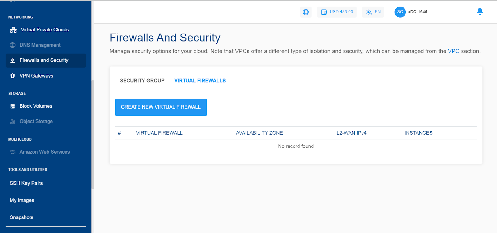
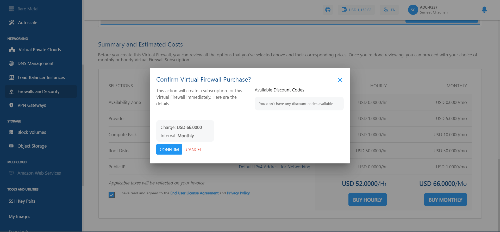

# Creating a Virtual Firewall

Virtual Firewalls can be created from the **Firewalls and Security** section in the main menu and navigating to the **Virtual Firewalls** tab. Using the **Create Virtual Firewall** button, the Service can be activated in a self-explained manner.

_**Note** - Apiculus currently only supports one Virtual Firewall per Availability Zone._

The Virtual Firewall service can be configured for provisioning in a self-service or an approval-based manner.

## Managing Virtual Firewall Provisioning Requests

_Needed only if approval-based provisioning is enabled for the VFI Service_

For approval-based provisioning, a request will be raised to the cloud administrator for provisioning approval, and, once approved or rejected, the requester user will be notified of the same. Upon approval/activation, the Virtual Firewall appliance will be visible in the list of Virtual Firewalls.

The request can be found in the **Requests** section under **Support & Operations** on the Apiculus admin console.

Admin can approve (or reject) the request by clicking on approve and entering any custom price overrides, as shown in the screenshot below and then clicking on **OK**. An email will be sent to both the end user and admin about the approval of the request.

The end user will receive an additional email mentioning subscription and service access details.

