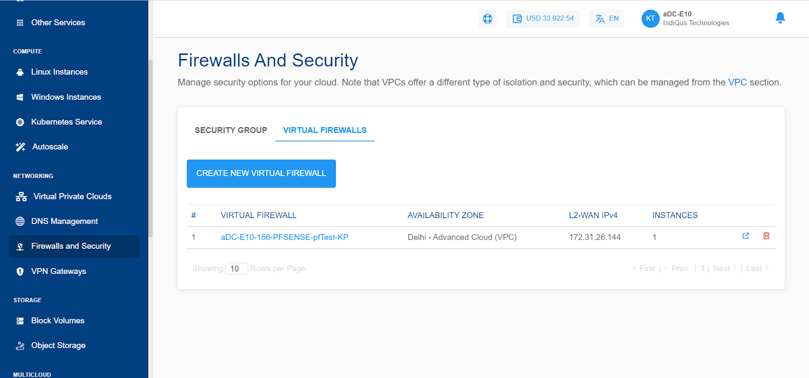
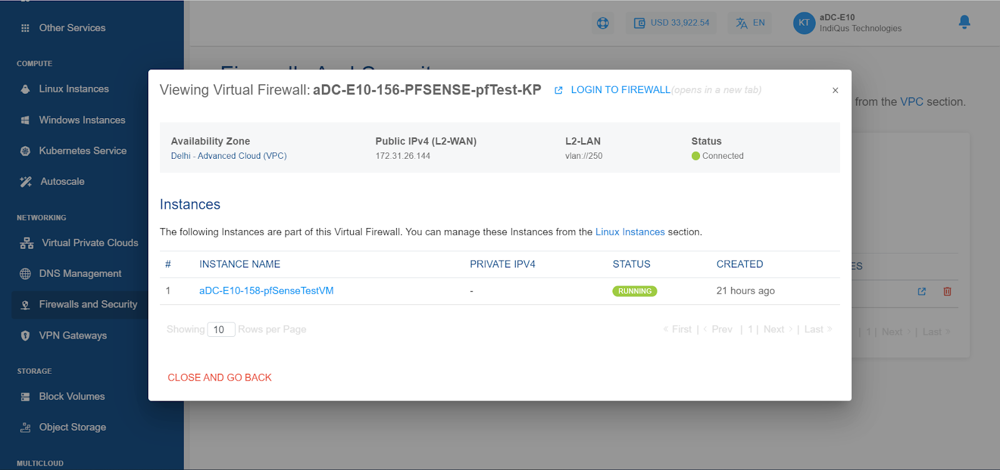

# Viewing VFI Network Details

As the VFI and the VFI-based network are created, CloudConsole users can view the enabled Virtual Firewall in the **Networking > Firewalls and Security** section. Clicking on this section, the following details will be shown:

1. List of all the Virtual Firewall domains as per the Availability Zone
2. Name of the Virtual Firewall
3. Availability Zone
4. L2-WAN IPV4
5. No. Of Instances associated with the particular Virtual Firewall
6. Quick operations like [accessing the VFI control panel](AccessingtheVFIControlPanel) and deleting the Virtual Firewall

Clicking on the Virtual Firewall name will show details of this appliance. Additionally, users will also be able to log in to the Virtual Firewall’s self-service UI.

