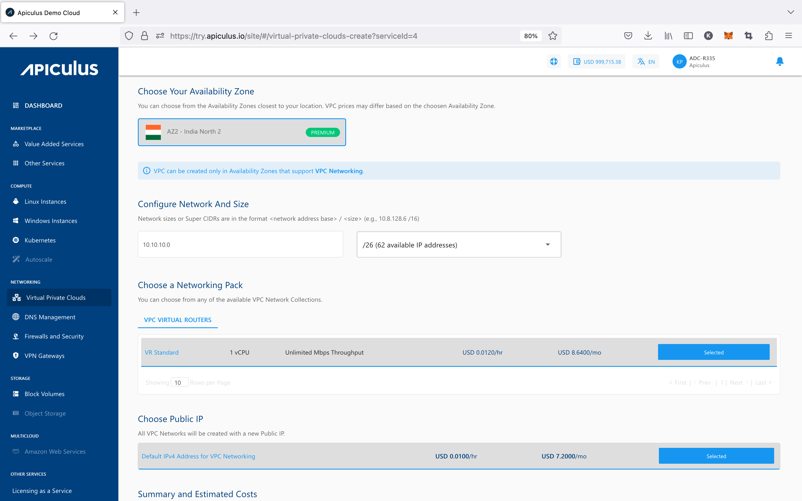
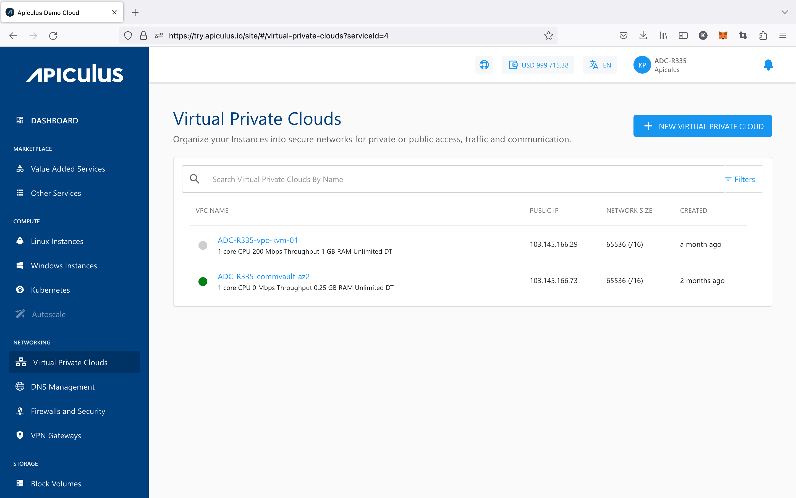
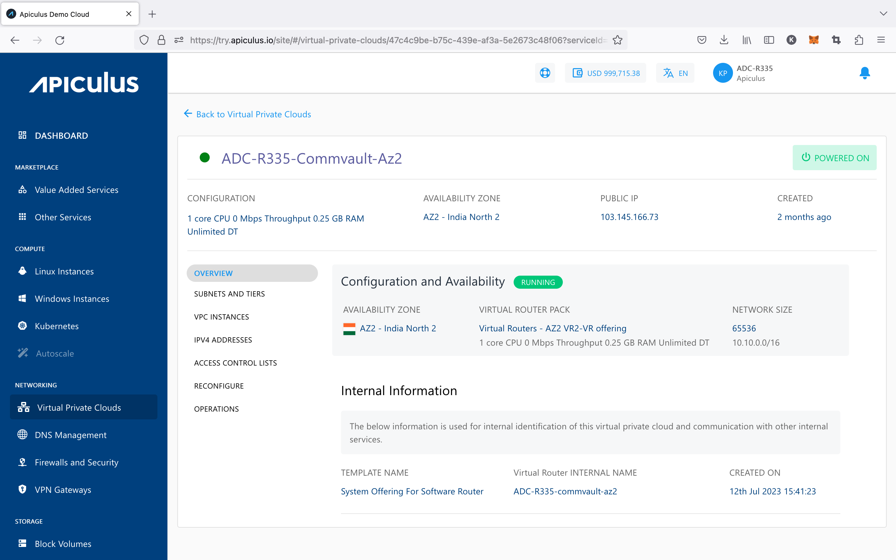

# Create, List and View VPCs

## Creating a VPC

To create a VPC, follow the below steps:

1. Navigate to **Networking > Virtual Private Clouds**
2. Click on the **_+ NEW VIRTUAL PRIVATE CLOUD_** from the top right.
3. Enter the name for your Virtual Private Cloud by following the naming convention mentioned below in the helper text.
4. Choose an Availability Zone, which is the geographical region where your VPC will be configured.
5. Specify network address base size and select size i.e. The **super CIDR** for the internal IP allocation in an x.x.x.x/x format.
6. Choose a Networking pack from the available network collections. 
7. Select the default IPV4 address for VPC Networking so that the VPC network will be created with a new Public IP address.
8. Verify the Estimated Cost of your VPC, based on the options that you have chosen from the Summary and Estimated Costs Section( _Here, both the Hourly and Monthly Prices summary will be displayed)_
9. Click on the check box after going through the policies mentioned by your cloud service provider.
10. Clicking on the BUY HOURLY or BUY MONTHLY button, a confirmation pop-over will open up, and the price summary will be displayed along with the discount codes if you have any in your account. 
    1. You can apply any of the discount codes listed by clicking on the **APPLY** button. 
    2. You can also remove the applied discount code by clicking the **REMOVE** button. 
    3. Clicking on the **CANCEL** button, this action will be canceled.
11. Click on the **CONFIRM** to create the VPC.

Once ready, you’ll be notified of this purchase on your email address on record. 

_**Note** - this might take up to 5-8 minutes. You may use the CloudConsole during this time, but it is advised that you do not refresh the browser window._

## Listing Available VPC

All VPC created in a user account can be accessed from **Networking >** **Virtual Private Clouds** on the main navigation panel. The listing will have the following details.

- VPC Name
- Public IP
- Network Size
- Created

## Viewing VPC Details

Clicking on the VPC name, you can view a list of sections and the various operations or actions you can perform by going inside the particular section. Below the VPC name is an informational view where you can find the details below.

- _Configuration_
- _Availability Zone_
- _Public IP_
- _Created._

Along with the summary, the following information is readily available under the **Overview** tab:

- Configuration and Availability
    - The instance's status, **RUNNING**, is displayed in Green, whereas **STOPPED** is displayed in greyed out.
    - Information about the Virtual Router Pack.
    - Information about the Network Size
- Internal Information- This displays the information that is used for internal identification of this VPC router and communication with other internal services.
    - _Template Name_
    - _Virtual Router Name_
    - _Created On_

From here on, VPC operations, configurations and other available functions can be managed by navigating to the respective tabs/sections.