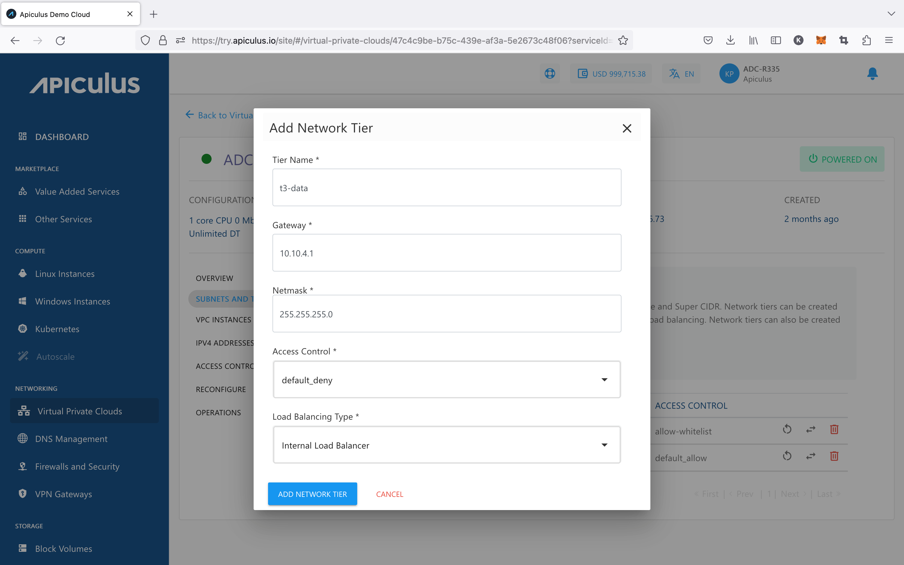

# Creating VPC Subnets/Tiers

VPCs follow the convention of 3-tiered architectures, with web, app, and DB tiers forming the norm. You can, however, configure these tiers to suit your application architecture or just follow the common convention.

To add a tier to your VPC, navigate to the VPC you wish to add the tier to, and click on the **ADD TIER** option present inside the **SUBNETS AND TIERS** section of the VPC. This will open up a dialog box asking you to provide the following information:

- **Name** of the tier.
- **Gateway** for the subnet. _Please note that this gateway should be consistent with the_ 
- **Subnet mask** for the tier/subnet.
- Default **access control** policy for this tier.
- **Load balancing** required on this tier. _Please note that to set up a public load balancer, you need to select_ **_Public LB_** _on this dropdown. Please also note that there can only be 1 tier of type Public LB in a network._

Clicking on **ADD NETWORK TIER** will create the tier or subnet to be used as part of the VPC.

There are three icons available on the right side for quick actions like restarting the network, replacing the access control list, and deleting the tier.

:::note
Only empty tiers can be deleted, which means that in order to delete a tier, ensure that there are no Instances and no NAT rule(s) associated with it.
:::