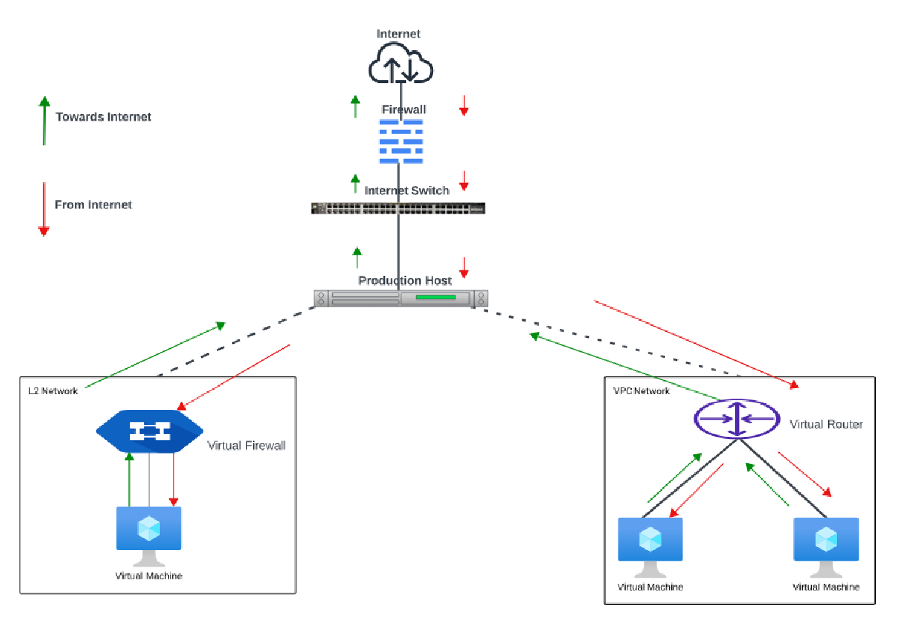

# Difference Between L2 Networks and VPC

## L2 Networks

L2 networks provide network isolation without any other services. This means that there will be no virtual router. It is assumed that the end user will have their own IPAM in place or that they will statically assign IP addresses.

The end-users can create L2 networks; however, network offerings that allow the network creator to specify a VLAN can only be created by the root admins.

CloudStack does not assign IP addresses to instances.

User data and metadata can be passed to the instance using a config drive (which must be enabled in the network service offering)

## VPC (Virtual Private Cloud)

VPC is a higher-level abstraction that allows you to create isolated network environments with more advanced features. A VPC can include multiple tiers, such as public and private subnets, and it provides for the implementation of advanced networking features like VPNs (Virtual Private Networks) and ACLs.

**The difference in Traffic Flow is simplified in the diagram below.**

