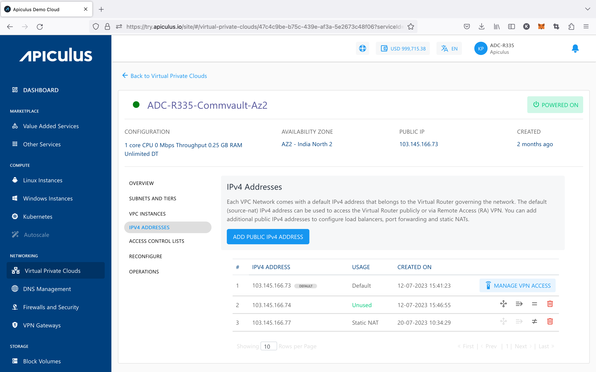
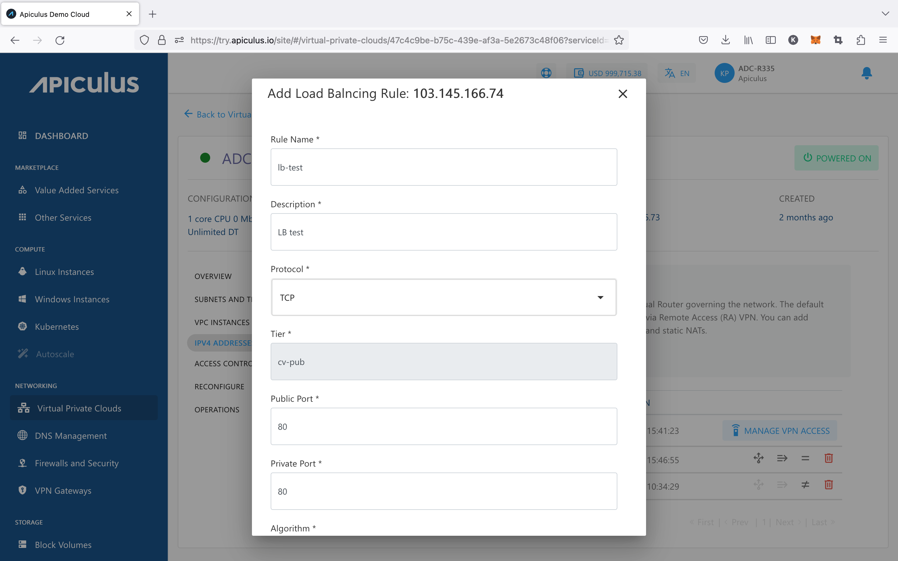
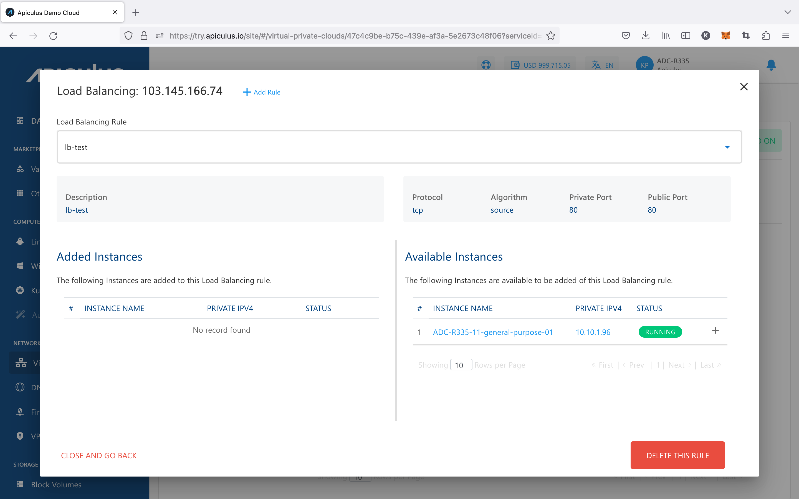
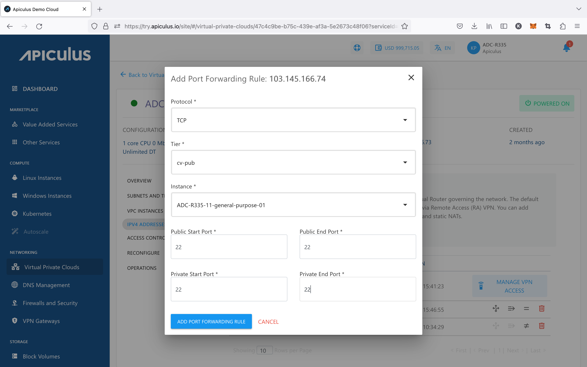
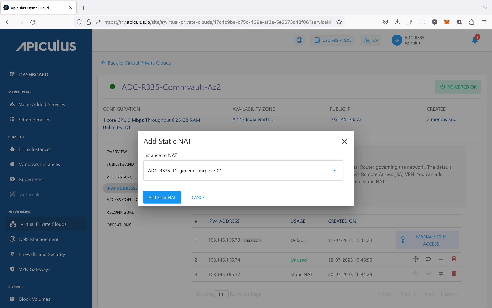

# IPv4 Addresses and VPC

IPv4 Addresses are an integral part of using VPC networking, and need to be used to access various components of the VPC. By default, a public IPv4 Address is assigned to the VR which can communicate through the internet to transmit traffic to/from the VR. This IPv4 can also be used for configuring remote access (L2TP) and site-to-site (IPSec) VPN connections.

## Using Additional IPv4

Primarily, IPv4 Addresses can be used for configuring access and NAT-ing via:

- Port forwarding
- Load balancing
- Static NAT

As a first step, a new IPv4 Address needs to be added to the VPC, which can be done using the **ADD PUBLIC IPv4 ADDRESS** button.

:::note
Public IPv4 addresses may carry a price which may vary depending on availability of IPv4 addresses in the country of operation, and/or how the service provider has priced them.
:::

## Configuring Load Balancing 

Choosing **+ Add Load Balancer Rule** from the menu will enable this IP address to be used as a load balancer. You’ll be asked the following details to first set this up as a load-balancing IP:

- A **name** and **description** for the load balancer rule.
- **Protocol** to use for the load balancer.
- The **load balancing algorithm** to use.
- **Public** and **private** port mapping.

Once the load balancer rule has been created, you can now go into the load balancer and add (or remove) virtual machines to this rule. To do this, follow these steps:

- Click on the **Load Balancer Rule** option next to the IP address listing, which would’ve got enabled now.
- In the dialog box that opens, click on **Add/Remove Virtual Machines**.
- In the overlay box that opens, you’ll be able to see virtual machines that are part of this load balancer, and the machines that are available to be added to this load balancer. Click on add (or remove) and **confirm** to update the load balancer rule.

To test whether the load balancer has been configured correctly, you can log into the virtual machines that are behind this load balancer individually, create an index.html on each virtual machine (with different content), and access the public IP address directly from your browser. If configured correctly, each browser page refresh should take turns in loading the two index.html pages.

:::note
A load balancer IP rule can only be configured if the tier/subnet type is set up_ **_Public IP_**_.
:::

## Configuring Port Forwarding

A port forwarding rule is required for accessing the virtual machines contained in a VPC. Since virtual machines in a VPC only have a private IP address, a public IP address is required for each virtual machine that you want to access from your terminal.

Choosing **+ Add Port Forwarding Rule** from the IP address menu will enable this IP address to be used as a port-forwarding IP. You’ll be asked the following details to first set this up as a port-forwarding IP:

- **Protocol** for port-forwarding.
- The **tier** and the **virtual machine** to port-forward to.
- **Public** and **private port** ranges. _Please note that the_ **_end ports_** _should be equal to or greater than the_ **_start ports_**_._

Once the port-forwarding rule has been created, you can now go into the port-fowarding IP address and view details of this rule. To do this, follow these steps:

- Click on the **Port Forwarding Rule** option next to the IP address listing, which would’ve been enabled now.
- In the dialog box that opens, you can view the virtual machine that this rule has been configured on along with the private and public port range mappings.

To test whether port-forwarding has been configured correctly, you can use the public IP to SSH into the virtual machine that the IP port-forwards to.

_Please note that a port-forwarding IP address can be used to configure multiple port-forwarding access rules but with one virtual machine. To port-forward into a different virtual machine, you’ll need to purchase an additional public IP address._

## Configuring Static NAT

Choosing the **Enable Static NAT** will allow you to use this public IP as a static translation to any of the contained virtual machines. To use this as a static NAT, choose the virtual machine you want to translate this public IP to in the dialog box that opens and click on **enable**.

To test whether static NAT has been configured correctly, you can use the public IP to SSH into the virtual machine that the IP is NAT-ing to.