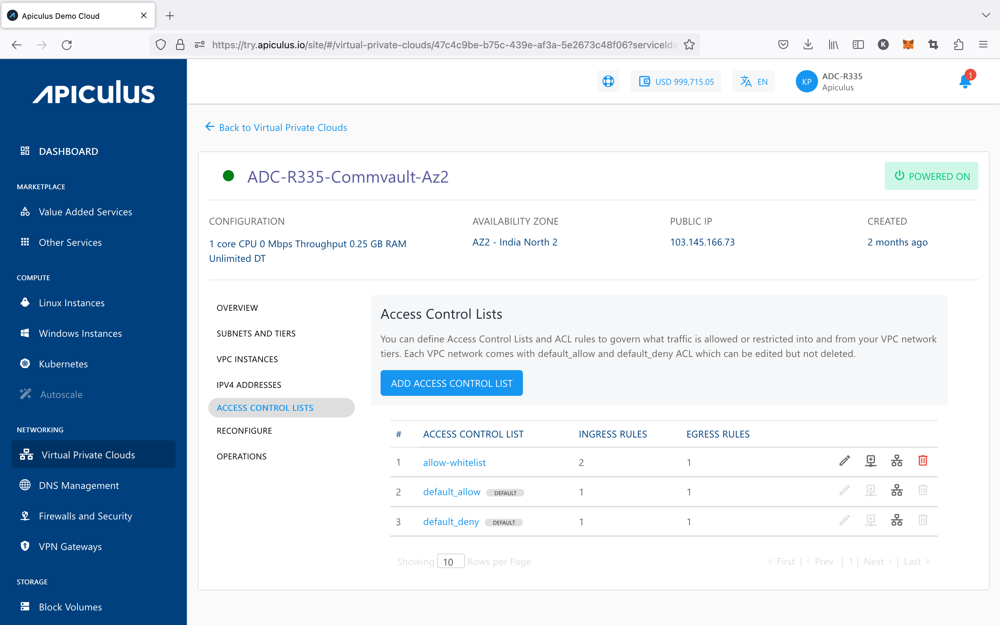
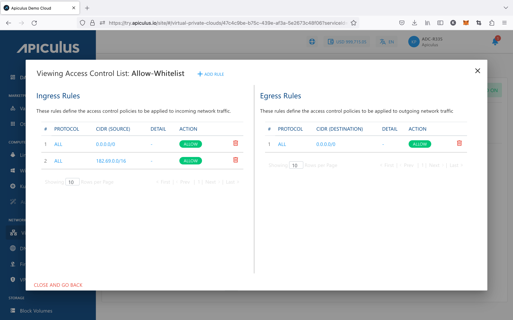

# Managing Access Control on VPC Subnets

Access control policies can be created using Access Control Lists (ACL) and configuring rules within these ACL (called ACL Rules). An ACL can then be applied to any tier within the VPC. These policies govern what traffic is allowed or restricted into and from your VPC network tiers.

:::note
Each VPC comes with **default_allow** and **default_deny** ACL, which can be edited but not deleted.
:::

ACL can be accessed from the **Access Control Lists** menu/tab item under VPC details. From here, the following actions can be taken on any available ACL:

- Editing ACL name
- Adding an ACL rule
- Assigning ACL to a tier
- Deleting the ACL

## Creating Custom ACL and Adding Rules

Custom ACL can be created by using the **ADD ACCESS CONTROL LIST** button and assigning the ACL a name. An ACL is essentially a collection of individual traffic control rules which need to be configured once an ACL is created.

Any available (existing or new) ACL can be viewed in detail by clicking on its name in the list view. This will show a list of rules defined to govern ingress/incoming and egress/outgoing traffic for the subnet. New rules can be created and existing ones can be deleted from this section.
