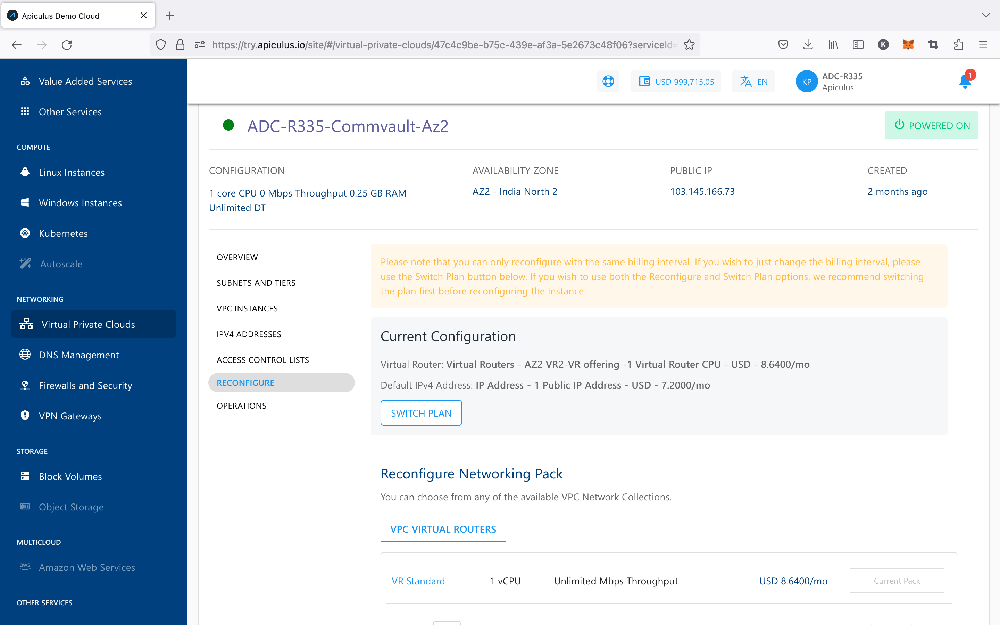
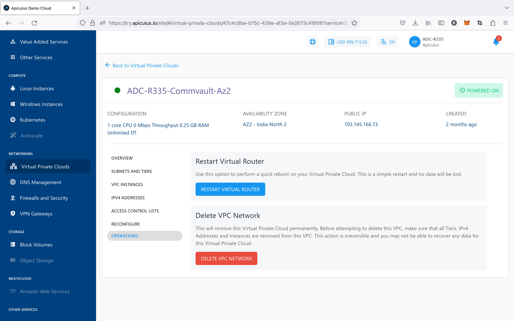

# VPC Management and Basic Operations

VPC management offers the following operations. These are basic VPC management actions and don't have any impact on the actual network configurations.

## Reconfiguring a VPC

The **Reconfigure** section/tab will list your current subscription details and allow you to reconfigure the networking pack, or switch between _hourly_ and _monthly_ pricing.

:::note
You can only reconfigure with the same billing interval. If you wish just to change the billing interval, please use the Switch Plan button. We recommend switching the plan first before reconfiguring the Instance if you wish to use both the Reconfigure and Switch Plan options. In either case, you will be charged as per the reconfiguration and not the existing.  
:::

## Powering ON/OFF the Virtual Router

Switching the VPC power state is possible using the 'power status' button on top. This will usually be green if the VPC is powered ON, and grey if powered OFF.

Additionally, a VPC restart is possible using the **RESTART VIRTUAL ROUTER** option available under the **Operations** tab/section. This will perform a quick reboot od the VPC. This is a simple restart, and no data will be lost.

## Deleting a VPC

A VPC can be deleted using the **DELETE VPC NETWORK** button under the **Operations** section/tab of VPC details. Deleting a VPC will remove it permanently.

:::note
Before attempting to delete this VPC, ensure that all Tiers, IPv4 Addresses, and Instances are removed from this VPC. This action is irreversible, and you may not be able to recover any data for this VPC.
:::