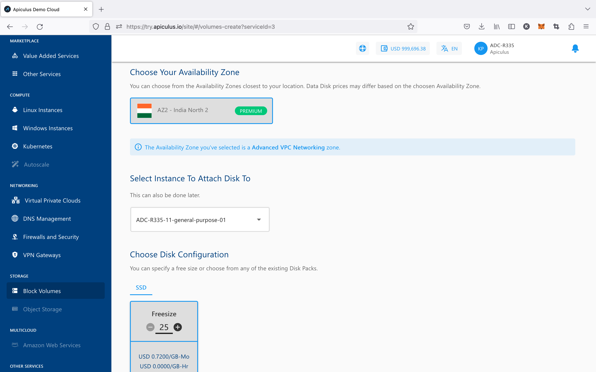
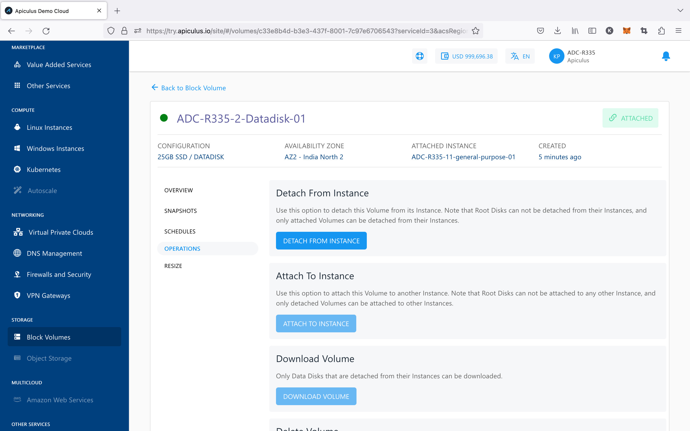

# Working with Instance Volumes

Each Instance on Apiculus (Linux or Windows) includes a 'root' disk or volume. This is the primary disk partition on the Instance, and by default, all operating systems, data, components and files reside on the root disk.

Further, Instances can have addon or 'data' disks attached to them which act as additional disk partitions. These data disks are modular and can be moved between multiple Instances.

Apart from this, there is no difference between a root disk and a data disk. Both types of Volumes are managed using the Block Volumes Service. However, based on the volume type, certain operations may not be available.

||Root Disks|Data Disks|
|---|---|---|
|Overview & Volume Information|Available|Available|
|Snapshot Management|Available|Available|
|Recurring Snapshot Schedules|Available|Available|
|Resizing Volumes|Available (via parent Instance)|Available|
|Volume Operations|Not Available|Available|

## Creating Data Disk

To create a Block Volume data disk, follow the below steps:

1. Navigate to **Storage > Block Volumes.**
2. Click on the **_+ NEW DATA DISK_** from the top right.
3. Enter the name for your Data Disk by following the naming convention mentioned below in the helper text.
4. Choose an Availability Zone.
5. Select an Instance from the list available in the dropdown to which you want to attach your Disk To. This is not mandatory; it can also be done later.
6. Choose the disk configuration from the available Disk packs, or you can use the free size option to specify the Disk configuration.
7. Verify the Estimated Cost of your Data Disk based on the options that you have chosen from the Summary and Estimated Costs Section( _Here, both the Hourly and Monthly Prices summary will be displayed)_
8. Click on the check box after going through the policies mentioned by your cloud service provider.
9. Clicking on the BUY HOURLY or BUY MONTHLY button, a confirmation pop-over will open up, and the price summary will be displayed along with the discount codes if you have any in your account. 
    1. You can apply any of the discount codes listed by clicking on the **APPLY** button. 
    2. You can also remove the applied discount code by clicking the **REMOVE** button. 
    3. Clicking on the **CANCEL** button, this action will be canceled.
10. Click on the **CONFIRM** to create the Data Disk.

Please note that this might take up to 5-8 minutes. You may use the CloudConsole during this time, but it is advised that you do not refresh the browser window.

Once ready, you’ll be notified of this purchase on your email address on record. The newly created Data Disk can be accessed from **Storage >** **Block Volumes** on the main navigation panel.

## Attaching/Detaching Volumes

Data disks can be attached to or detached from Instances. This action can be considered similar or equivalent to using an external disk drive on a laptop or computer. The following points should be considered while working with data disks:

1. Data disks can be attached to only one Instance at any given point in time;
2. Data disks can remain detached/unattached;
3. Data disks can be used across Instances with different operating systems;
4. Data disks can only be used on Instances in the same Availability Zone.

Attachment/detachment actions can be performed from the **Operations** section/tab under data disk details.

## Downloading a Volume

Detached data disks can be downloaded as 'virtual hard disk' files for portability. This option is also available in the **Operations** section/tab of data disk details.

:::note
Data disks will be downloaded as .ova files.
:::

## Deleting a Volume

Data disks can be deleted from the **Operations** section/tab in the data disk details. Deleting a data disk will remove the Volume and all associated snapshots and snapshot schedules, and is an irreversible action.

To delete a root disk/volume, simply delete the parent Instance.