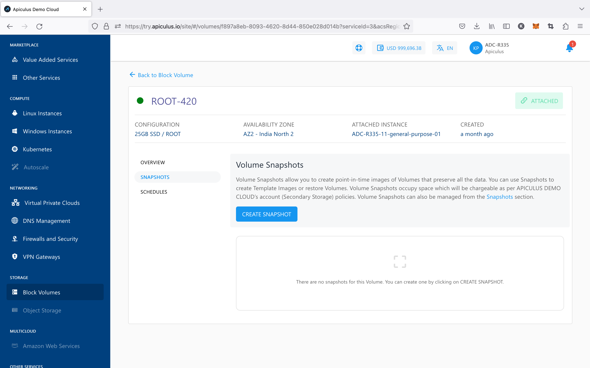

# Working with Volume Snapshots

The Apiculus Block Volumes Service allows for extensively working with volume snapshots. Snapshots are point-in-time 'images' of the contents of a volume and can be used as a restoration point for the parent volume. The following sections outline all available snapshot functions and capabilities on Apiculus CloudConsole.

## Creating Instant Snapshots

Volume snapshots can be created manually with the current timestamp by using the **CREATE SNAPSHOT** button under the **Snapshots** tab/section of any disk. Doing so will create a snapshot which can be used to further create an Image (template) or restore an existing volume.

## Creating Automated Snapshot Schedules

Apiculus CloudConsole users can create snapshot policies for their root and data disks. These schedules allow for strategic management of data retention policies and can be used as an alternative to using a backup solution. Snapshot schedules can be managed from the **Schedules** section of disk details.

The following schedules are supported:

|Schedule|Description|
|---|---|
|Hourly|Snapshot will be taken every specified _minutes past the hour_|
|Daily|Snapshot will be taken every day at the specified _time of day_|
|Weekly|Snapshot will be taken every week on the specified _day of week_ and at the specified _time of day_|
|Monthly|Snapshot will be taken every month on the specified _day of month_ and at the specified _time of day_|

While configuring snapshot schedules, the following points should be considered:

- There can only be one policy per schedule, and creating a second policy of an existing schedule will override the previous one;
- All schedule options support time specifications in custom time zones;
- All schedule options allow for a _snapshots to keep_ option, which is a limit on how many snapshots to keep (or rotate after) as the retention policy.

## Creating a Volume from a Snapshot

Volume Snapshots created manually or using a schedule will be listed under the **Snapshots** section of disk details. To create a new data disk using a snapshot, the option to _create volume_ can be used, which will initiate a purchase flow similar to [creating a data disk](https://docs.apiculus.com/hc/en-in/articles/13233099636125).

:::note
This operation may have associated billing impacts.
:::

## Creating an Image from a Snapshot

Volume Snapshots can be used to create OS Images which can be used at the time of Instance creation. This can be done by using the option to _create image_ which will make the template available and listed under the **My Images** section.

:::note
Images occupy account-level storage space which may be billed on usage by the service provider.
:::