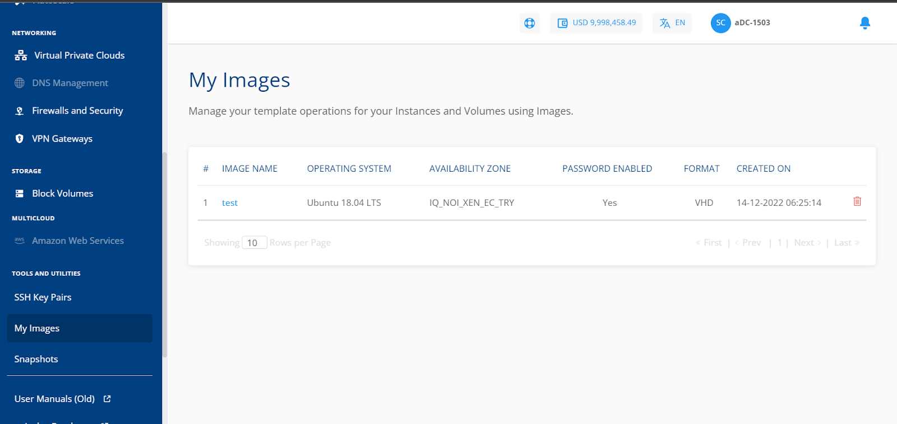
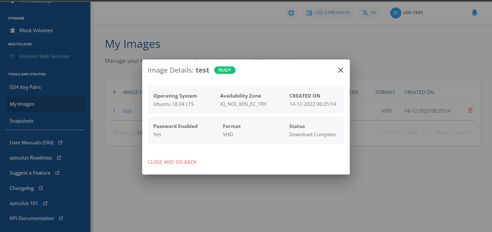
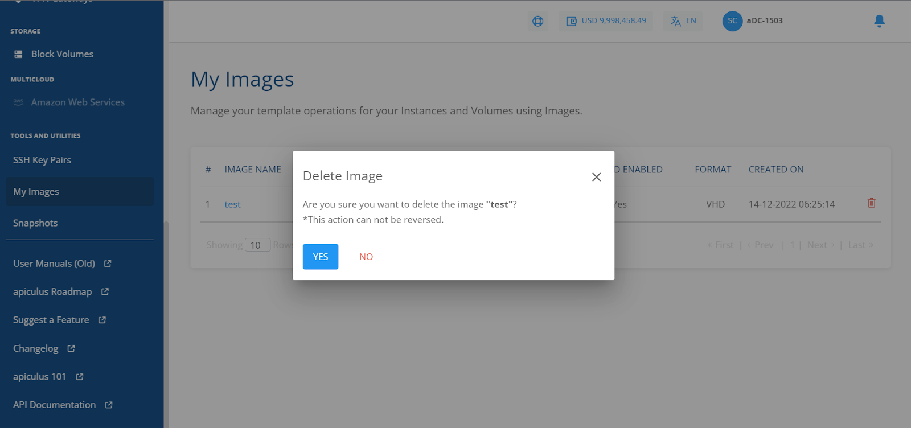

# Managing Custom Templates and Images
Custom OS templates can be created from a Volume Snapshot. These custom templates can be found under **Tools and Utilities > My Images** with the following details:

- _Image Name_
- _Operating System_
- _Availability Zone_
- _Password Enabled_
- _Format_
- _Created On_

You can delete the image by clicking on the delete icon present and the rightmost corner. You can also check the status by clicking on the image name.

	

These Images can be used while creating new Linux or Windows Instances and found under the **MY IMAGES** tab in the OS Collection section.