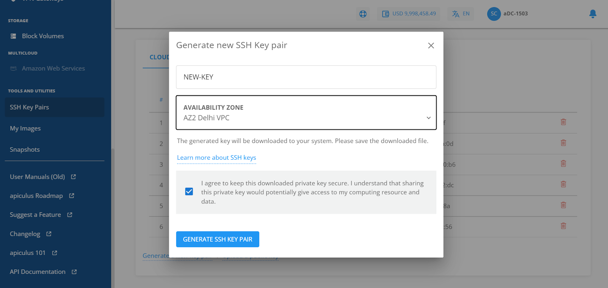

# Managing SSH Keys and Key Pairs for Linux Instances

Apiculus CloudConsole allows you to create secure shell connections to Instances in your account by using SSH keys, in addition to using Instance passwords. Passwords, due to their very nature, can easily be compromised. On the other hand, SSH keys are encrypted signatures that function only when there’s a match between their public and private components.
## Managing SSH Keys

SSH keys can be managed from the **Tools and Utilities > SSH Key Pairs** section on the main navigation panel. You can create SSH keys in any of the following ways:

1. New SSH key pairs can be generated from the **Generate a new key pair** button on the bottom left. This will create a public-private key pair and download the private key on your system while keeping the public key in your Apiculus CloudConsole account. You can then use the downloaded private key to connect to virtual machines that are associated with the corresponding public key.

2. Existing public keys on your system can be uploaded to your Apiculus Cloud account using the **Upload a public key** button. This assumes that you already have a key pair on your system and just upload the contents of the public key (typically, a .pub file in your system’s SSH directory) to your Apiculus CloudConsole account.

## Using Linux Instances with SSH Keys

To use an Linux Instance with an SSH key, it needs to be associated with a key first. This can be done in two ways:

1. While [creating a new Linux Instance](https://docs.apiculus.com/hc/en-in/articles/12794047199389), in the provisioning details form, choose any of the SSH options from the **Use SSH key pair** option under **Choose an Authentication method**. This will let you:
    1. Generate a new key pair on the go.
    2. Upload a public key from your system.
    3. Choose an already added SSH key in your apiculus Cloud account.
2. For existing Instances, you can set or reset SSH key associations by going into the Instances  Operations section and using the **Reset SSH Key** option. To use this option, the instance needs to be stopped first. This option will only let you choose an SSH key already added to your Apiculus Cloud account.

Once a SSH key pair has been associated with a Linux Instance, the [Instance can be accessed via a SSH connection](https://docs.apiculus.com/hc/en-in/articles/12794257856797), authenticated with the private key on your local machine.

## Deleting a SSH Public key

If a SSH public key is deleted from the Apiculus CloudConsole account, you'll no longer be able to connect to the Linux Instance(s) associated with the key pair. You'll still be able to use a password to connect to the Instance.

To re-associate a key pair, you might need to open the known_hosts or hosts file on your local machine and delete all rows/entries related to the Instance(s) using the SSH key pair.