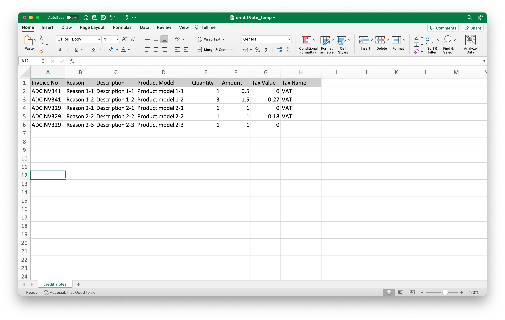

# Creating Credit Notes in Bulk

Apiculus offers the means to upload credit notes in bulk, i.e., generate unique credit notes based on multiple linked invoices. This can be done via downloading the credit notes spreadsheet template and uploading the correctly filled file(s). The template is available as .ods and .xlsx files and can be downloaded by clicking on the **+ ADD CREDIT NOTES** button in **Billing and Financials > Credit Notes**.

:::note
Each row of the file being uploaded should have a unique combination of column cells; there should be no empty cells in the file being uploaded, except for tax amount and tax name. For invoices where multiple line items need to be credited against, the exact number of rows should be created.
:::
### Example

This will generate two credit notes:

- **ADCINV341-C** with the line items:
    - Product model 1-1
    - Product model 1-2
- **ADCINV329-C** with the line items:
    - Product model 2-1
    - Product model 2-2
    - Product model 2-3

On creation, the account owners of the linked invoices will be notified of the credit note(s).