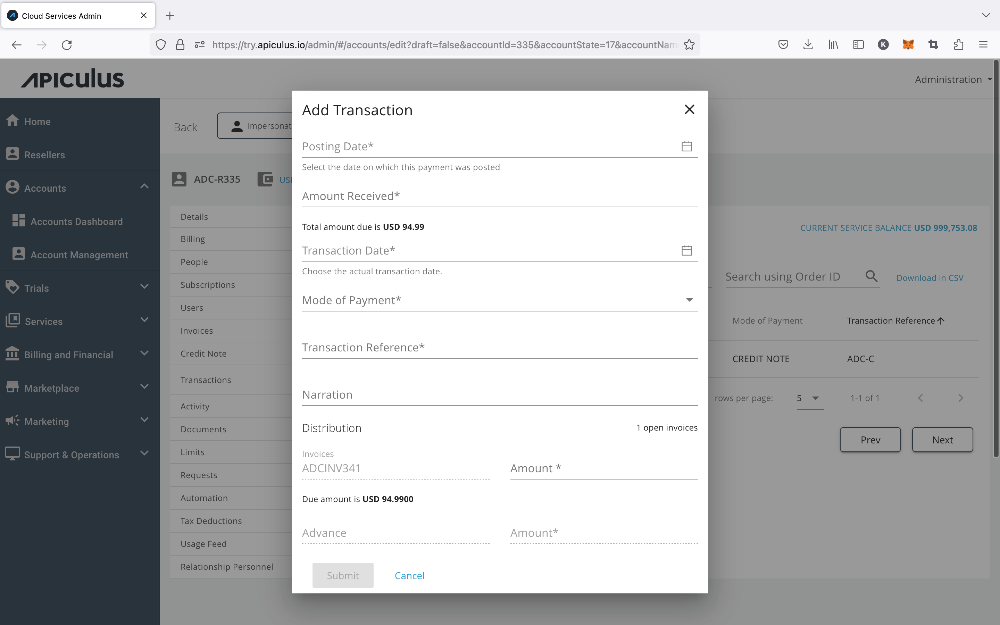

# Recording Transactions and Offline Payments

Payments received outside the Apiculus system can be recorded as Transactions using the Apiculus admin console. These payments may be against invoices that are open or may be 'advance' payments that adjust against invoices generated in future.

Transactions can be recorded at the account level or from the **Billing and Financials > Transactions** section of admin console.

## Recording Single Transactions

Single transactions can be recorded at the account level by navigating into the target customer account and clicking the **+ Add Transaction** link in the **Transactions** section/tab. This will list all open invoices (fully open and partially open) and allow for specifying the transaction amount, date, mode, reference, narration, and information on apportioning the amount between all open invoices. Any remainder amount that is not apportioned against an invoice will be recorded as an advance, and will reflect in the next invoice.

## Recording Bulk Transactions

Bulk transactions can be recorded using the spreadsheet template available (as .ods and .xlsx) on clicking on **+ Add Payments** in the global list of transactions. Bulk upload allows recording transactions for multiple customers against multiple invoices at once.

---

:::note
On transaction recording, all target customers will be notified on email. All recorded [transactions are visible to subscribers/customers](https://docs.apiculus.com/hc/en-in/articles/12844407671965) in their Account Centre.
:::