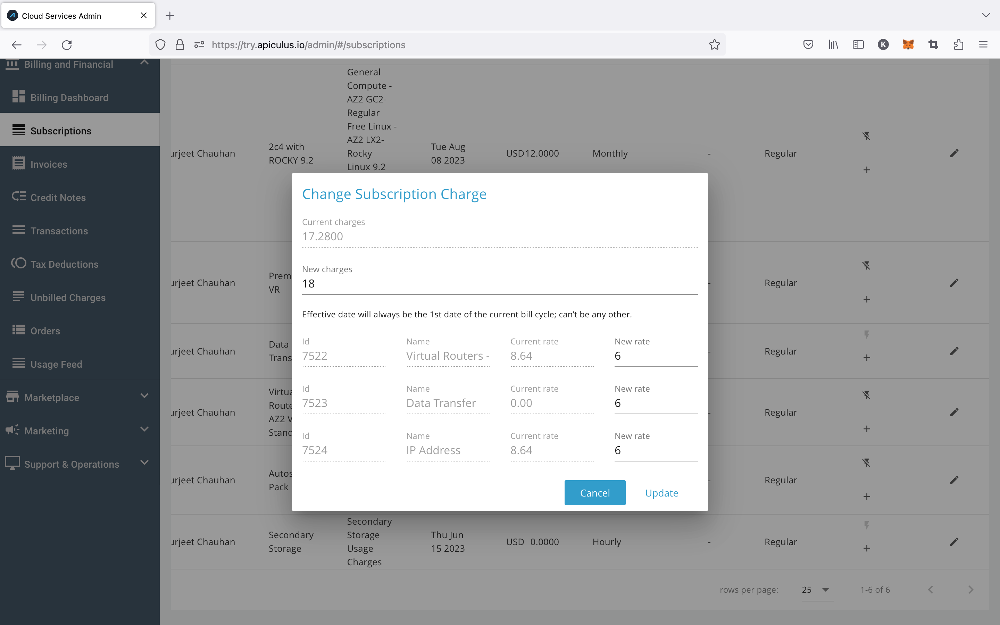

# Updating Subscription Charges

Apiculus admin console offers an easy means of handling subscription price changes. Admins can update subscription prices after a resource has been created and bring the new prices in effect from the current billing cycle.

Subscription price updates can be done from the subscriptions listing under an account's details or from the global list under Billing and Financials.

Entering a new price will make the components visible and the distribution of charges across components can de defined. _The sum of component prices should add up to the total target price._

Once updated, the subscriber will be notified over email (and SMS, if enabled).