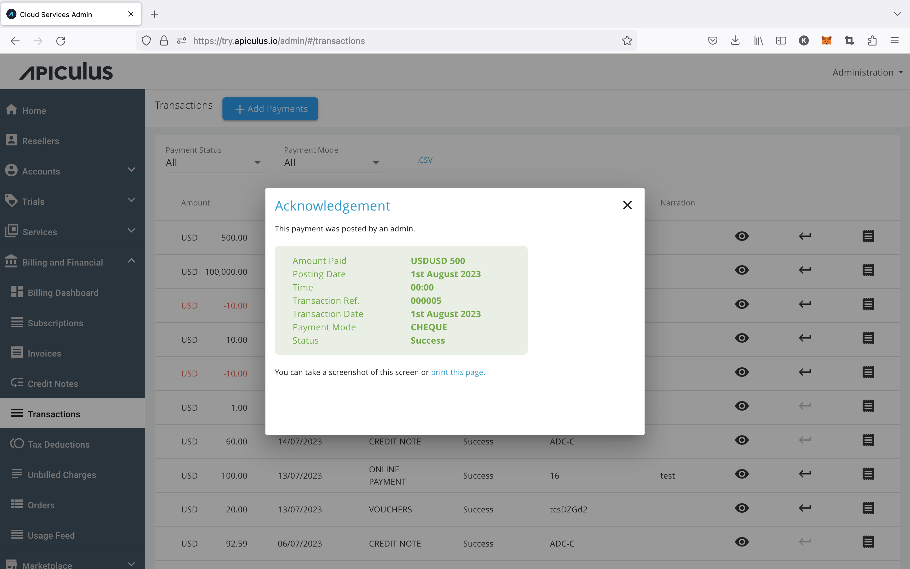

# Viewing Receipts and Acknowledgments

Transaction receipts can be viewed for any transaction in an account-level or global listing by clicking on the _receipt_ icon. This will show the current status of any transaction along with transaction reference, associated information, details received from payment gateway etc.

:::note
This receipt is a valid financial instrument and can be saved for auditing and reporting by taking a screenshot.
:::