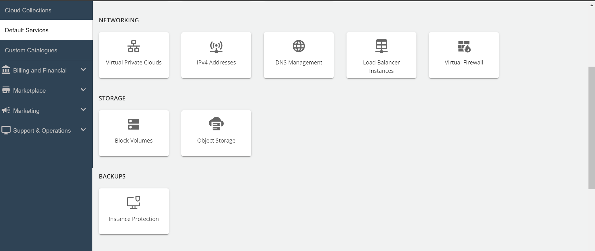
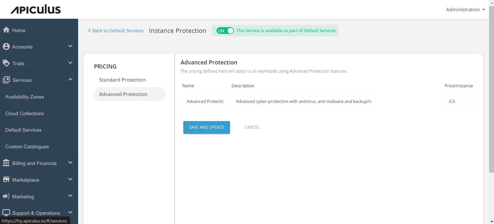

# Configuring Instance Protection

Administrators can configure  Instance Protection via the Default Services section using these steps:

1. Navigate to the default services in the primary menu.
2. Choose "Instance Protection " within the Backups section.
	

3. Activate the switch at the top, indicating the availability of this service as part of the default services. All associated sections will become enabled.

4. Click on the **Standard Protection** section and specify the price in GB/Mo as per your requirement in the standard protection section. This price will be displayed to the end-user and will be charged to them as per the usage.
	

5. Click on the **Advance Protection** section and specify the price per Instance as per your requirement in the advance protection section.
	

6. Click on **SAVE AND UPDATE** to save the changes you made.

Finally, return to Default Services and select "**PUBLISH DEFAULT CATALOGUE**."
