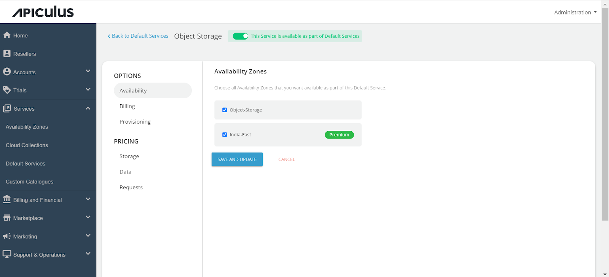
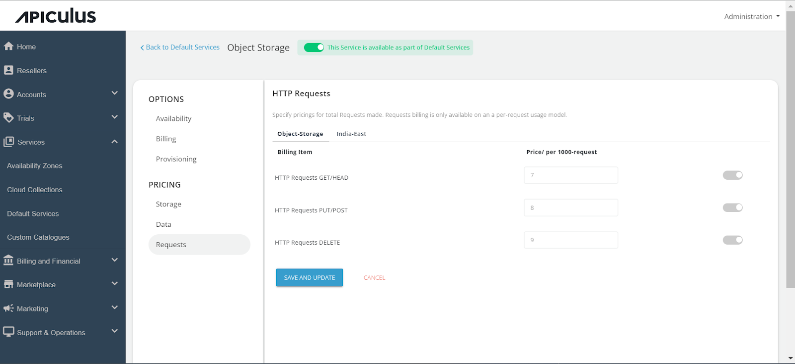
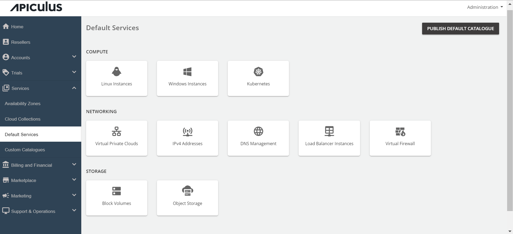

# Configuring Object Storage

Admins can configure the Object storage from the services section. To configure the Object Storage service, follow these steps:

1. Go to the **Default Services** in the primary navigation menu.
2. Select **Object Storage** under the **Storage** section.
3. Enable the switch present at the top, i.e. **This service is available as part of default services**. All the sections will be enabled.
4. Go to the Availability section. Select the **availability zones** where you want to offer the service. Then, click on **Save & Update**.
	

5. Click on the **Billing section**. The following two options will be listed. i.e. **Prorate on Entry** and **Prorate on Exit**.
	

6. Click on the **Provisioning** section to offer the Object Storage service as _approval-based_. Enable the approval required switch. Enabling the switch, you will get two more options, i.e., Custom instructions that you want to send to the end user upon approval; you can also attach a maximum of 5 files up to 3 MB. 
	

7. Click on the **Storage** under Pricing, Click on the AZ, and specify the _pricing in GB/hr._ 
	

8. Click on the **Data** section, click on the Availability Zone, and specify the _pricing in GB/hr for both Data Rate in and Data Rate out._ 
	

9. Click on the **Requests** section, select the availability zone, and specify the pricing for the below:
    a. HTTP requests GET/HEAD
    b. HTTP requests PUT/POST
    c. HTTP requests DELETE

	 Return to the _Default Services_ and click on "**PUBLISH DEFAULT CATALOGUE**."

	