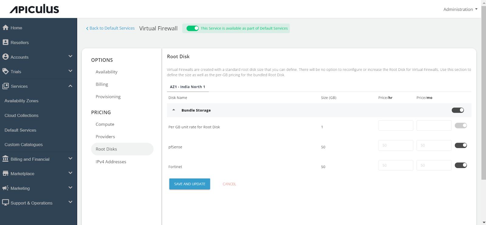

# Configuring Virtual Firewall Instances

Follow these steps to configure Virtual Firewall Instances:

1. Access the **_Default Services_** in the main navigation menu.
2. Select "**_Virtual Firewall_**" located within the **Networking section**.
3. Turn on the switch at the top to make this service available as part of the default services. This action will enable all associated sections.
4. Move to the **_Availability section_**. Choose the availability zone from which you want to offer the service, then click "**_Save & Update._**"

5. Within the Billing section, two options are available: 
	- _Prorate on Entry_
	- _Prorate on Exit_

6. Virtual Firewall Instances can be provisioned to an approval-based system within the **_Provisioning_** section. This is done by activating the "A_pproval Required_" switch, offering additional functionalities such as sending custom instructions to end-users upon approval and attaching up to five files, each up to 3 MB.

Further, the _**PRICING**_ options include:

- Access the _Compute section,_ select Availability Zone, and enable the compute pack for the desired collection available to end-users.

- Navigate to the _Providers Section_, choose the Availability Zone, and activate both providers—**_pfSense and Fortinet_** based on your requirement. Specify the descriptions and then establish the pricing accordingly.

- In the _Root Disks section_, select the availability zone and enable packs for the designated collection.

- Click on the _IPv4 Addresses_ to enable the default IPv4 Address for VPC Networking and define the pricing.

Finally, return to Default Services and click on "**_PUBLISH DEFAULT CATALOGUE_**."

