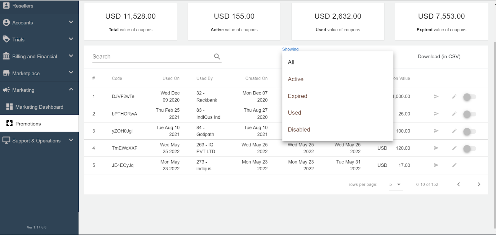
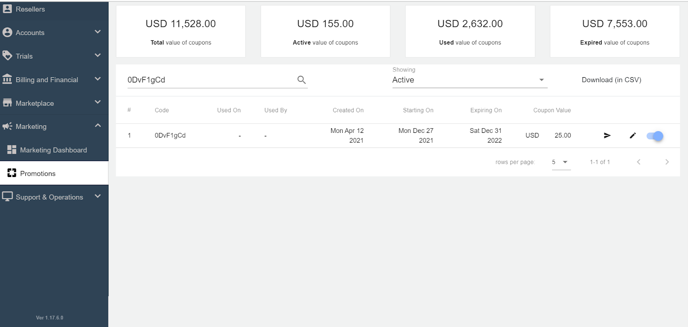
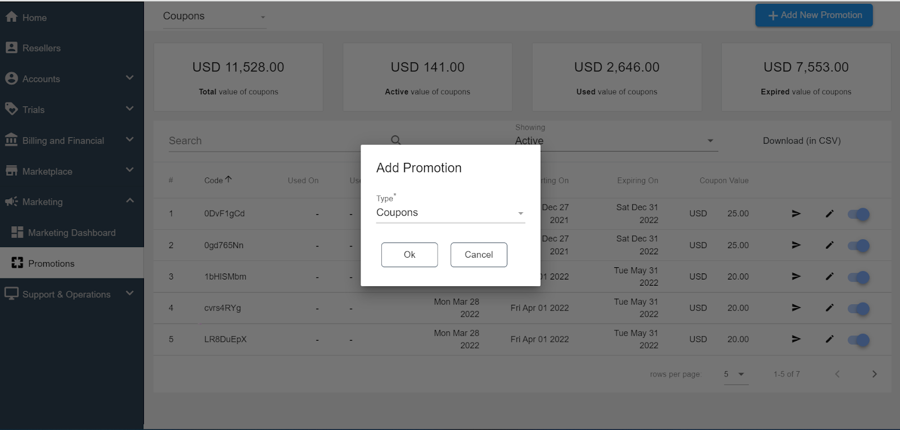
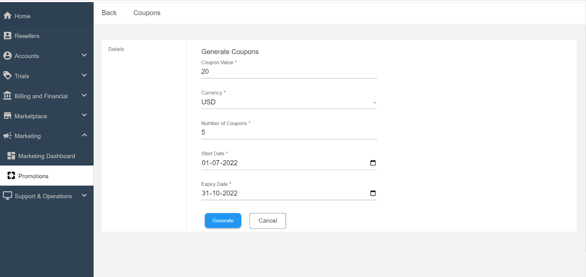

# Working with Coupons

## Viewing Coupons

Coupons can be accessed from the **Marketing > Promotions** section on the main admin navigation panel and switching the view to show Coupons from the switcher dropdown on top of the listing.

Apiculus comes with a built-in mini dashboard for viewing information related to Coupons. It will highlight the _Total value of coupons, Active value of coupons, Used Value of coupons, and Expired value of coupons_. The details are listed below:

1. It shows the information of all the coupon codes that have been created till now. Using the showing filter, the active, expired, used and disabled coupon codes information can be filtered and viewed.

2. There is a search option also for searching the discount code.

3. The various information about the discount codes that are listed is as follows

- - **Coupon Code-** _This is the coupon code that is generated by the system and is displayed to the customer_
    - **Used On-** _The date on which it was used by the customer._
    - **Used By-** _The customer’s name who has used the coupon._
    - **Created On-** _The date on which the coupon code was generated/ created._
    - **Starting On-** _The date from which the coupon code can be redeemed_
    - **Expiring On-** _The date on which the coupon code will expire._
    - **Coupon Value-** _The value of the coupon code._

4. This information can also be downloaded. CSV format.
5. These coupon codes can be edited by clicking on the pencil button and enabled/disabled by using the switch button.

## Creating/Generating the Coupon Codes

1. Admins need to click on the **+ Add New Promotion** button from the top right corner.
2. After that, they need to specify the **Coupons** as type and click on **Ok**.

3. The admin needs to fill in the required details such as **Coupon Value**, **Currency**, **Number of Coupons**, **Start** and **Expiry Date**, and click on **Generate** button.

4. The generated coupons are displayed under the promotions section.

## Sending the Coupon Code to the Customer

Now the coupon codes can be emailed quickly to the customer by simply clicking the notify button, selecting the customer from the list, and then clicking on **Send Email.**

## Redeeming Coupons
Subscriber customers can redeem Coupons from the [Wallet](https://docs.apiculus.com/hc/en-in/articles/12844407671965) section of their [Account Centre](https://docs.apiculus.com/hc/en-in/articles/12844047233693). Redeeming a Coupon will instantly add the Coupon value to their service balance/wallet.