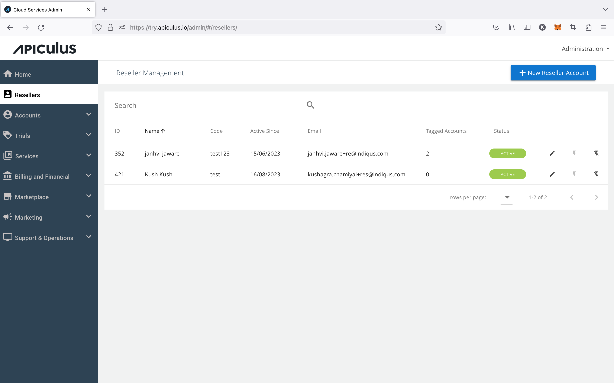

# Overview

The reseller and channel management feature on Apiculus is aimed at service providers who have partners and customer acquisition channels. Service provider administrators can manage resellers, and each reseller can log in to view accounts that are tagged using their respective reseller codes.

:::note
This is an experimental feature and offers limited functionality. This is not to be construed as a white-label partner/distribution management module. This feature is under further development.
:::

## What's Included

The reseller management features include:

1. [Reseller creation and reseller record management](CreatingandUpdatingResellers)
2. [Tagging subscriber accounts with resellers](ManagingReseller-taggedAccounts)
3. [Viewing reseller billing reports and tagged accounts](ManagingBillingforResellers) _(via Metabase)_

:::note
To use this feature, the [Reseller Module should be enabled](/docs/GettingStarted/AdvancedConfigurations/EnablingResellerModule) on the platform. 
:::