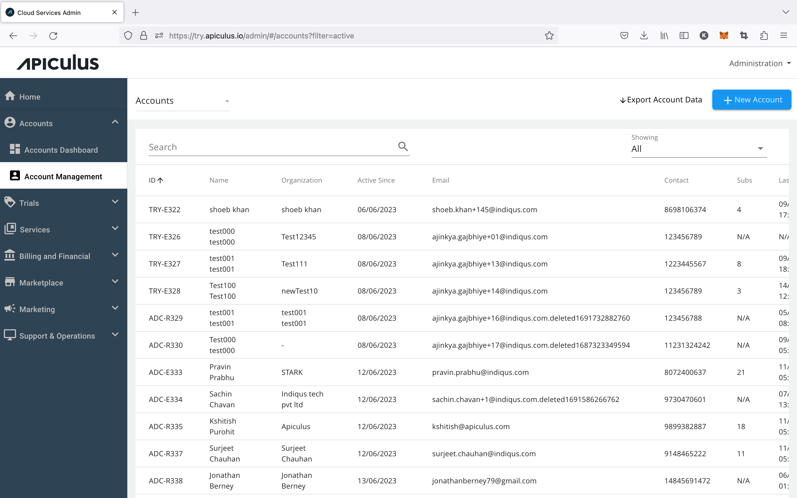

# Account Management Overview

Apiculus allows service providers to manage their subscriber/customer life cycles end to end. On Apiculus, a suscriber account is one of the key entities that the entire solution is designed for. While the Apiculus solution supports many features that impact the subscriber life cycles and can be managed from various sections of the solution, this section only focuses on actions that can be performed from the **Accounts** section of the Apiculus service provider admin panel.

## Viewing Subscriber Accounts

All subscriber accounts can be viewed as a list by navigating to **Accounts > Account Management**.

The following operations are available at this level:

- Searching for accounts
- Filtering accounts by their states (_active, restricted, disabled, terminated_)
- Switching between published, drafts, accounts awaiting confirmation and accounts pending profile completion
- Viewing subscriber account details
- Creating new subscriber accounts