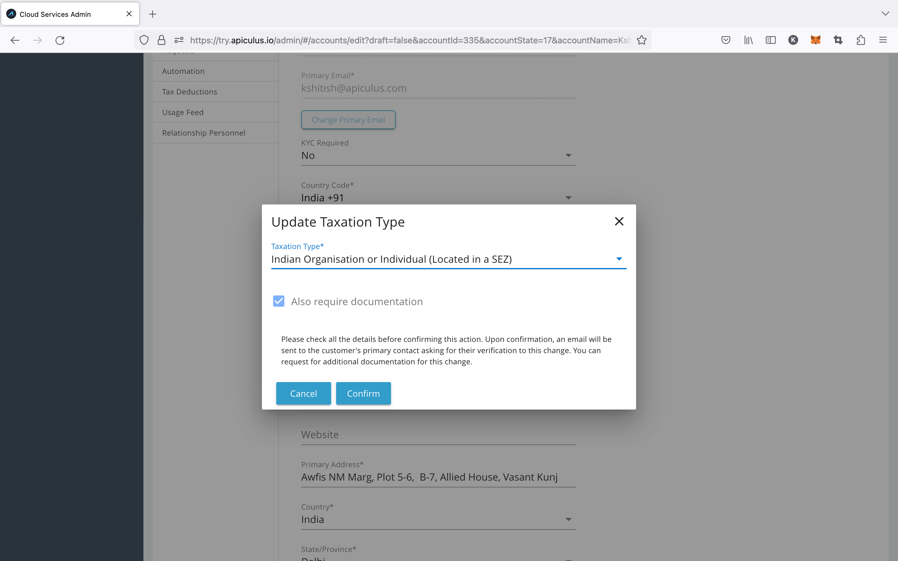
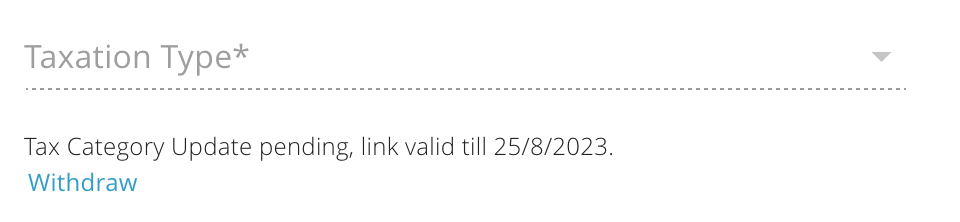
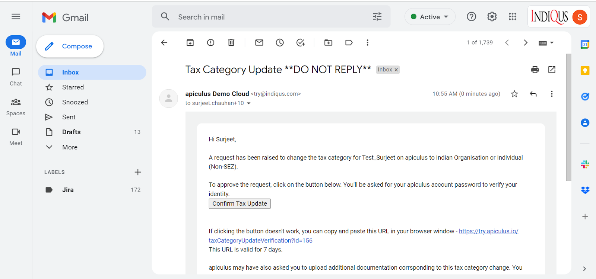

# Updating a Subscriber's Taxation Category

Service provider admins on Apiculus can change customers' taxation categories. Organisations acquiring special tax status, exemption status, or incorrect classification while creating an account are covered.

The following steps outline this action:

1. **_Admin Login > Account Management_** **_>_** **_Account Details_** **_>_** **_Basic section > Taxation Type field > Update Taxation Type_**

2. Once the Confirm button is clicked, a verification email will be sent to the customer, valid for seven days. Also, the Update button will be changed to Withdraw. If admins click the Cancel button, the action will be canceled.

3. If the admin selects the ‘Also Require Document’ option, the account will go back to being Unverified, which means that the user will now have to upload documents from the Profile > Documents section.
4. A verification email will be sent to the customer, valid for seven days; the update button will be changed to withdraw.
5. If the admins click on the Withdraw button, then an email will be sent to the customer.

6. Once the customer verifies this by clicking on the **URL** or the Confirm Tax Update button from the email they have received, the tax category will be successfully updated.
7. Once the customer verifies the change, a confirmation email should be sent to the admin(s) and the customer.

:::note

- _The tax category change will be reflected in the current billing cycle._
- _Tax category can be changed multiple times in a billing cycle by following the same standard process._
- _Any billing generated before the current billing cycle will not be changed and will follow the previously-defined tax category._
:::