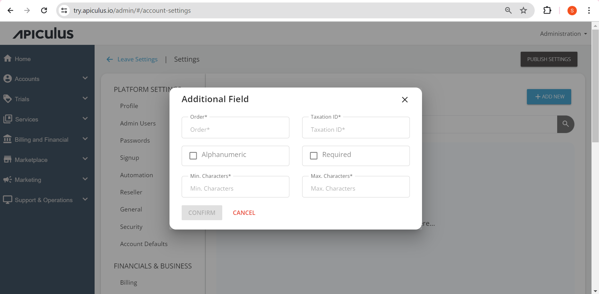

# Configuring Additional Fields

The taxation IDs and 'custom' profile fields that need to be associated with a subscriber account can be found listed under **Settings > Financials & Business > Additional Fields** and can be edited along with the order. Also, minimum and maximum characters can be defined, and the taxation IDs can be deleted.

To add the additional IDs, click on the + Additional Fileds and enter the required details. The example is shown in the screenshot below:

