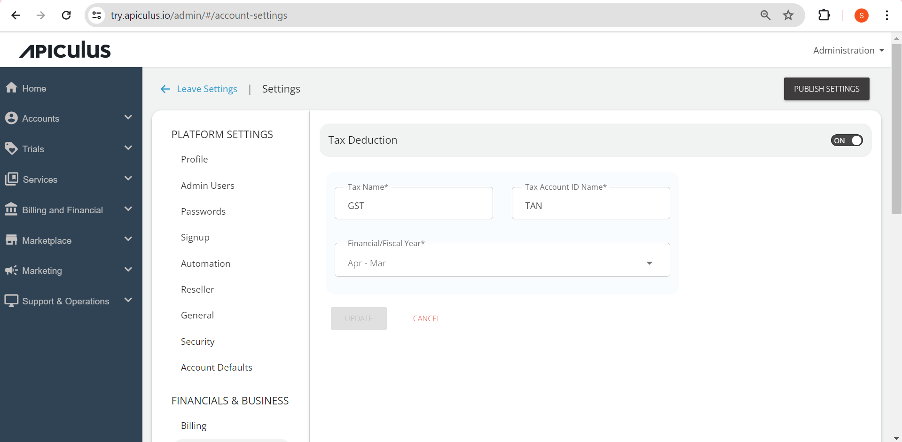

# Configuring Tax Deductions

Apiculus supports recording quarterly tax deductions for all customer invoices. The Tax Deductions section lists all such tax deductions and also allows for adding new items. The Tax Deductions feature is optional and needs to be enabled from the global settings, where admins also get the ability to define their country’s fiscal period and fiscal quarters. This can be accessed under **Settings > Financials & Businesss > Tax Deductions**.

:::note
Once set up, tax deductions can be recorded via Subscriber Account Management.
:::

