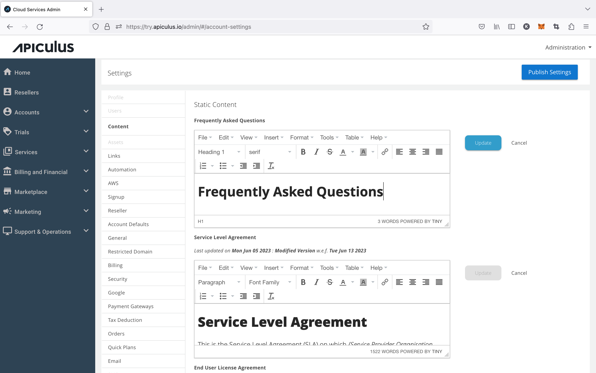
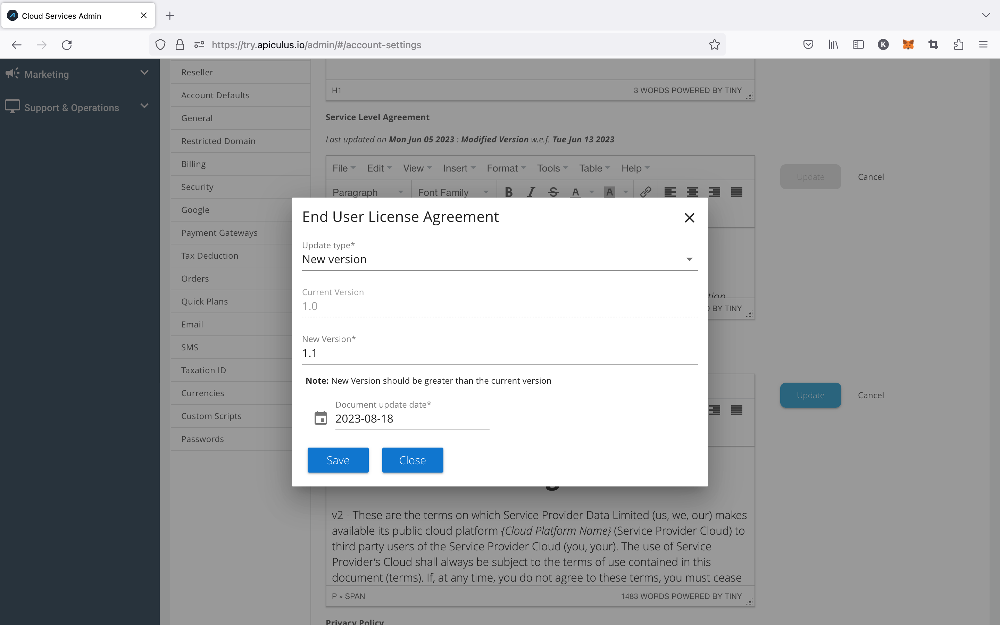

# Publishing Standard Static Content

The static content that the user can view from his portal is configured from content settings. This content is helpful in information and lets the user know about the service provider’s EULA, SLA, privacy policy, etc. The admins need to type or can paste the content into the respective section and update it. If some policy is updated or a newer version is uploaded, then the updated date and time are captured, and this information is sent to the end-users via email.

Apiculus includes a built-in content versioning and management system. Each time a static content document is updated, the system triggers an acceptance from all subscribers and admin users.

## Updating Standard Documents/Policies

Admins need to perform the following steps for updating the policy

1. Navigate to > Content > Service Level Agreement | Privacy Policy > Update > Select policy update type (Modified or Newer version)> Select document update date.
2. Click on Save so that the changes are saved.
3. Click on Publish Settings for publishing the updated settings.

4.  Once the policy type is updated, all admins and customers will be sent an email informing them about the policy update changes, along with the link to the updated policy._
5.  Whenever a customer logs in after the policy update, the customer needs to accept the updated policy by clicking on the acceptance checkbox; otherwise, they won’t be able to do anything on the portal.