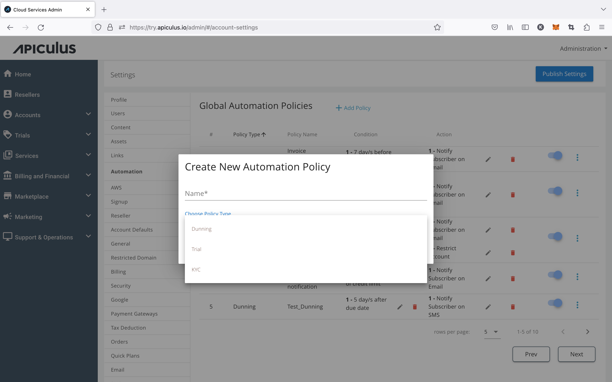
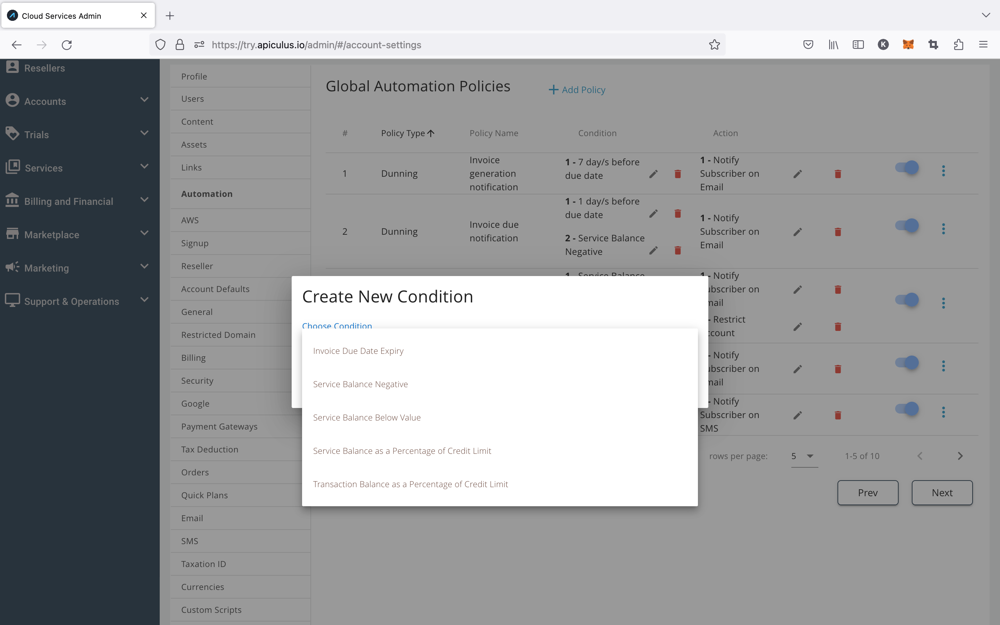
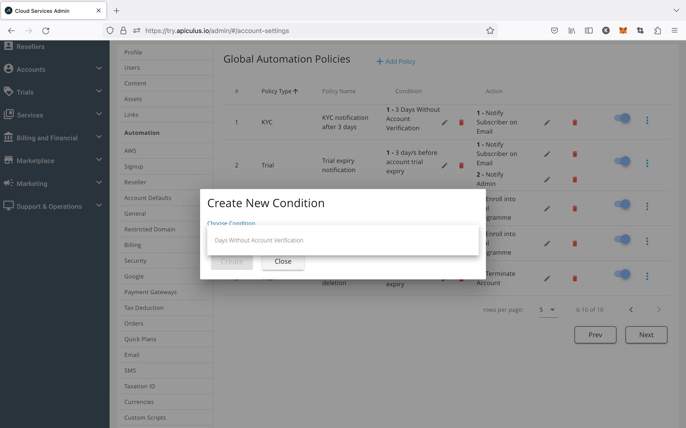
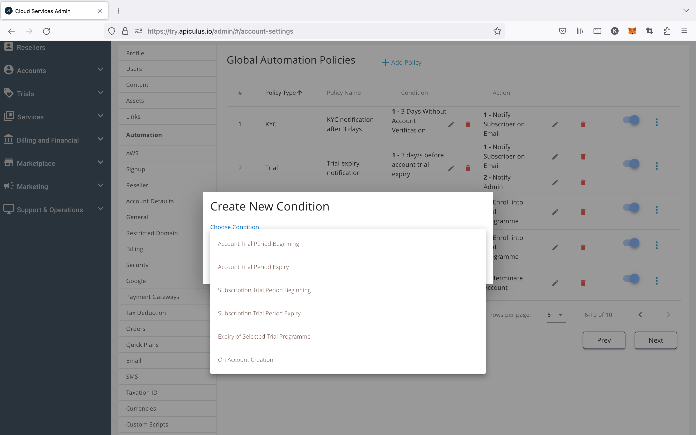
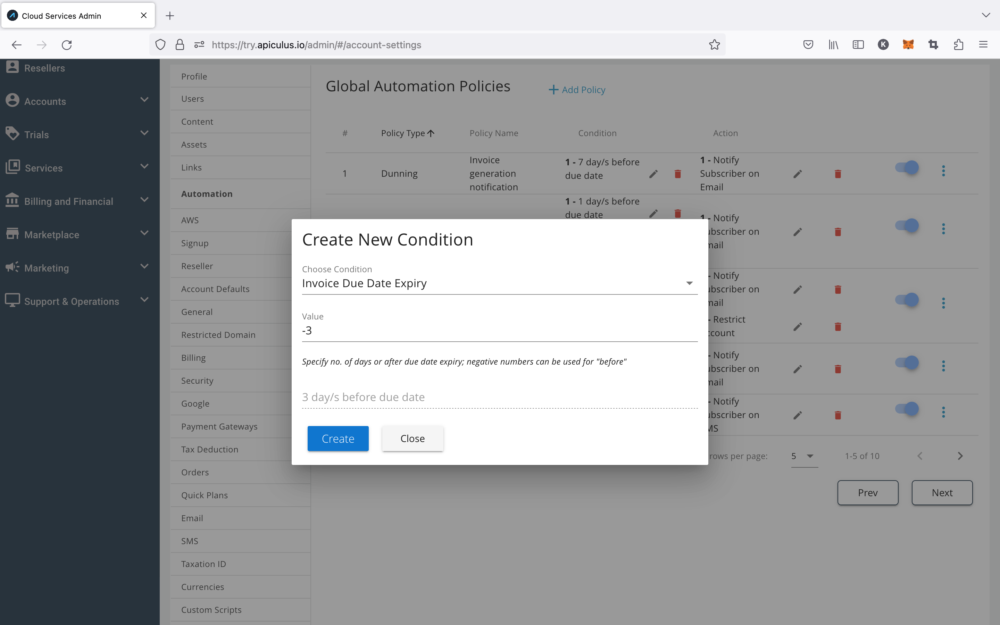
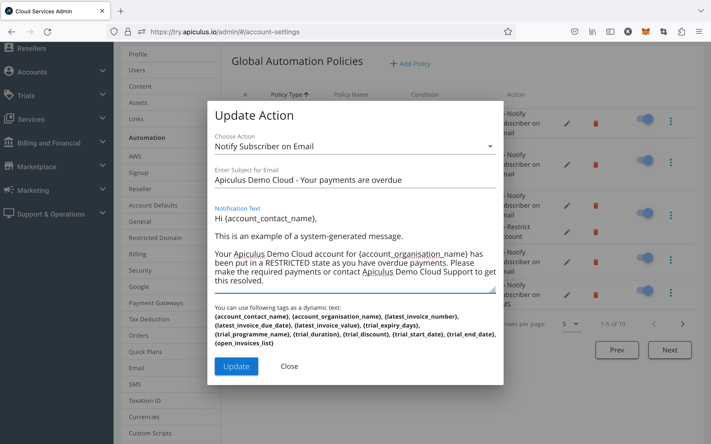

# Configuring Automation Policies

Apiculus allows service providers to define automation policies and workflows to handle scenarios around invoice reminders, non-payments, and customer identity verification.

## Creating an Automation Policy

Account actions can be automated by creating automation policies that trigger an action based on a trigger condition. These policies can be created globally, which are applied to all new subscriber accounts and can also be overridden for individual accounts.

For creating a new policy, click on +Add Policy, then a dialogue box will open up, enter the name for the policy, select the policy type and click on Create.

Once the policy is created, the admin must add the condition and desired trigger to this created policy.

## Configuring Condition Triggers

For the desired automation policy, click on + Add Condition and select a condition from the list of requirements. Various Policy types, conditions, and actions are listed below.

#### Policy Types

- Dunning
- Trial
- KYC
- Legacy

**Condition**: This is the condition on which the action is triggered.

**Dunning Conditions**

- Due date expiry of an invoice
- No. of days without account verification
- Negative service balance or service balance below a fixed value
- Service balance going below a percentage of the credit limit
- Transaction balance going below a percentage of the credit limit

**KYC Conditions**

- No. of days without account verification.

**Trial Conditions**

- Account Trial Period Beginning
- Account Trial Period Expiry
- Subscription Trial Period Beginning
- Subscription Trial Period Expiry
- Expiry of Selected Trial Programme
- On Account Creation (self-sign up or admin-assisted accounts)

Example of a configured **dunning** condition trigger that checks for **3 days before invoice due date.**

## Configuring Automation Actions

For adding action, click on the + Add Action.

**Action** - These are the actions that are triggered based on the condition.

- Notification (email or SMS)
- Restriction from new purchases
- Suspension of accounts
- Termination and deletion of all resources
- Enroll into Trial Programme

For notification actions, smart tags can be used to insert dynamic data in the email or SMS. Smart tags currently available are:

1. Primary contact name
2. Organisation name
3. Latest invoice number
4. Latest invoice due date
5. Latest invoice due amount
6. Days to trial expiry
7. Trial programme name
8. Trial duration
9. Trial discount/benefits
10. Trial start and end dates
11. List of open invoices

Example of a **notification by email** action using **smart tags**.
