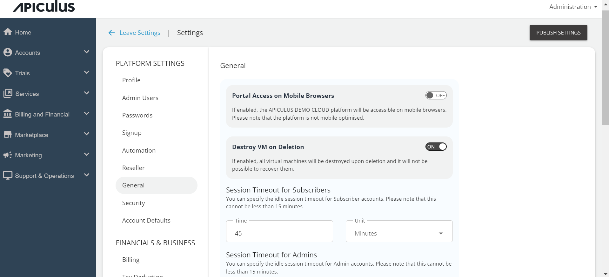

# General Platform Settings

This setting includes the options whose concurrent behavior will be applicable as a whole. For example, it can be something like destroying VM once it is deleted, or it can be like enabling the Apiculus platform to access through mobile.

:::note
Apiculus platform UI is **not** mobile-optimised.
:::