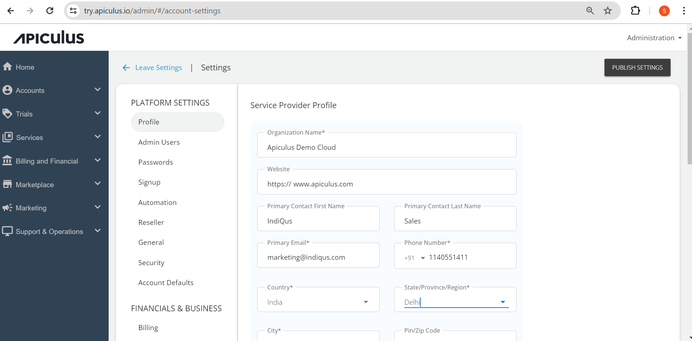

# Managing Service Provider (SP) Profile

The profile consists of all the service provider details; admins can configure all the details straight from the name of the cloud they will offer as to the address. The profile details are given below:

1. **Name** - The name of the cloud by which service providers want to deliver the services in the market.
2. **Primary Contact name** - Enter the service provider’s contact person’s name.
3. **Primary Email** - Specify the service provider’s email address.
4. **Website** - Specify the URL of the website.
5. **Primary Address** - Enter the service provider’s address and the Zip code.
6. **Other Phone(s)** - Enter the service provider’s contact number(s).
