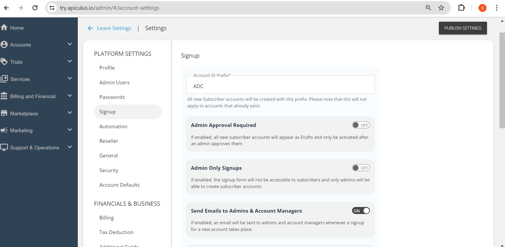

# Signup Settings

Signup settings can be customised as per the service providers’ need; if they wish on account signup, they want to be notified, i.e., they should receive an email, or their customer’s account id should start with some particular choice of sequence. All the configurations regarding account signup that include both self-signup and admin-assisted accounts can be made from signup settings.

1. **Account ID Prefix** - You can specify the prefix for the accounts. By default, all account IDs will start with this defined prefix.
2. **Admin Approval Required** - If this switch is on, that means all account signup requests will show up as draft accounts and will be published only after admin approval.
3. **Admin-only Mode** - If this is enabled, it means the self-signup form will be disabled and only admins will be able to create the subscriber accounts.
4. **Send to Admins and Account Managers** - If this option is selected, an email will be sent to admins and account managers whenever signup for a new account happens.
5. **Send to Other IDs** - If this option is selected, all the specified email ids will receive an email whenever a new account signup happens.