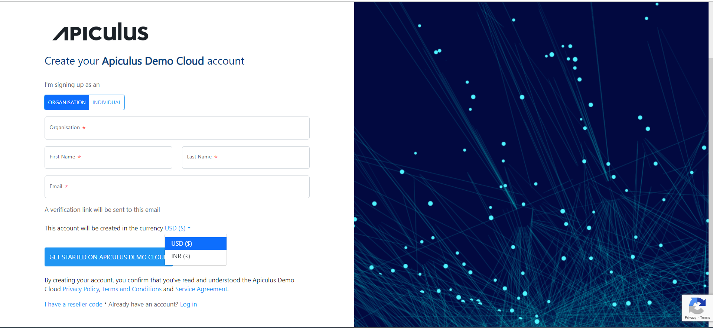
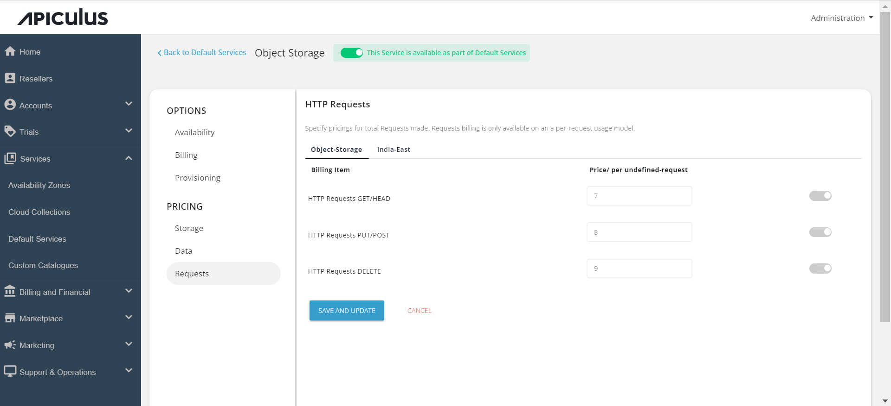
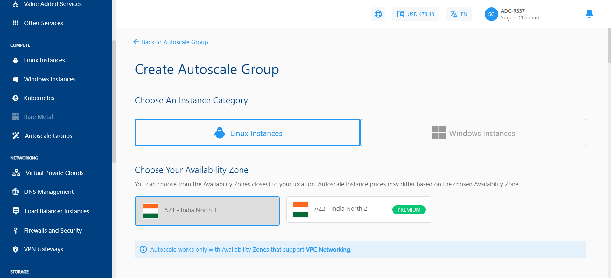

# Version 2.2.0.0
```
Date: 16.01.2024
Type: Major
```

## About this Release

This is a major release with a new feature, a refresh of existing features, and enhancements across the Apiculus system.

## New Feature: Support for Multicurrency

In this release, Apiculus embraces multicurrency support, allowing service providers to offer their services in various currencies tailored to the preferences of individual customers. End-users now have the flexibility to sign up with a currency different from the base currency supported by the service providers, with their accounts reflecting the chosen currency. Service providers can conveniently choose a currency during customer onboarding and establish default credit limits for each selected currency.



### Refresh: Object Storage

Building on the user experience enhancements introduced in version 2.0, Apiculus presents a revamped and user-friendly interface for the Object Storage service. Service provider admins can now easily enable the service and configure prices, while end-users enjoy an intuitive experience when utilising the service.



### Refresh: AutoScale

The AutoScale feature in Apiculus undergoes a comprehensive refresh, transitioning from the previous Ragnar and Zabbix combination to CloudStack's native AutoScale feature. This feature empowers end-users to manage their workloads by configuring autoscale groups and defining scale-up and scale-down policies as required.

:::note
The brand-new AutoScale feature is native to the Apiculus technology stack, and we'll be deprecating the older system. Our Support team will reach out to you with the next steps regarding upgrading to the new AutoScale.
:::



## Other Enhancements and Fixes

- A new payment gateway, HDFC Payment Gateway, is introduced, offering customers an additional secure payment option.
- Fixed a UI bug while reconfiguring disk size under Instance Operations.
- Fixed an issue with the active time session out where the active users were experiencing timeouts because token expiry wasn't refreshing for ongoing interactions.
- Resolved a UI issue in the Kubernetes Cluster where the incorrect throughput value was displayed. RAM was erroneously shown in place of throughput.
- Increased the VFI instance name length to 55 characters, aligning it with ACS standards. Previously set at 48 characters.
- Fixed a UI issue in which the Security Group tab will only be displayed if an EC/Basic zone is configured.
- Introduced an API to display Trial Benefits applied to each subscription on the invoice.
- Integrated changes in the response structure for the Machine listing API in the MAAS List, ensuring accurate information is displayed.