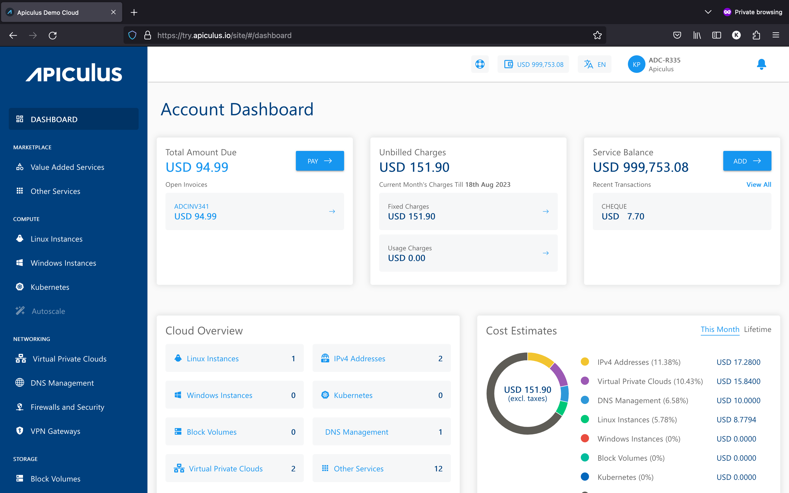

# Welcome Service Providers

Apiculus is an end-to-end cloud-as-a-service solution that addresses the technology, business enablement and customer experience needs of regional, domestic and edge cloud service providers. Apiculus presents itself as an all-in-one technology platform that combines cloud service monetisation, infrastructure management and customer life cycle management, and offers an integrated solution for cloud providers in edge markets.

Apiculus enables:

- New service providers to launch and operate independent, green-field public clouds with 100% data localisation.
- Established IaaS providers to transform and scale their VPS service into a full-fledged multi-service public cloud offering.
- Service providers to offer a standardised service delivery and user experience.
- When installing Node.js, you are recommended to check all checkboxes related to dependencies.

## Stack Components
Items in ***blue*** are Apiculus software capabilities; items in ***grey*** are services and extensions that can be monetised; items in ***green*** are service provider’s assets.

import DocusaurusSvg from './StackComponents.svg'; 

<DocusaurusSvg />;

## Features and Specifications
### Self-service and Administration

Apiculus brings a powerful layer of self-service along with a multitude of configurable options for managing customer journeys, admin operations and cloud-commerce.

| FEATURES                                      | DESCRIPTION                                                                                                                                                     |
| --------------------------------------------- | --------------------------------------------------------------------------------------------------------------------------------------------------------------- |
| **SELF SERVICE**                              |                                                                                                                                                                 |
| Onboarding, Provisioning and Cloud Management | Offer a complete self-service experience to your customers for onboarding, provisioning and cloud resource management.                                          |
| Admin Operations and CMP Administration       | Manage your cloud operations, customer accounts, service requests, and marketplace mechanics - all from a single administration console.                        |
| Marketplace Management                        | Offer a wide range of compute, networking, cloud-native and value-added services with single-click provisioning and seamless ease of management and operations. |
| **ADMINISTRATION**                            |                                                                                                                                                                 |
| Complete Customer Profile and Records         | Manage and get a 360-degree view on your customers’ profiles and activities.                                                                                    |
| Customer Identity Verification Workflows      | Define workflows for mandatory or regulatory KYC identity verification of your customers.                                                                       |
| Self-service Platform Configurations          | Configure the end-user experience, right from branding to policy documentation, custom links and platform default behaviours.                                   |
| Role-based Admin Access                       | Onboard various functional personnel with our customisable role-based access system.                                                                            |
### Integrated Billing and XaaS Monetisation
With Apiculus, service providers can set up a marketplace of IaaS, PaaS, multi-cloud and other value added service offerings. Apiculus offers not only the listing of services, but also a complete automated and integrated provisioning-operating-billing paradigm.

| FEATURES                                           | DESCRIPTION                                                                                                                                                  |
| -------------------------------------------------- | ------------------------------------------------------------------------------------------------------------------------------------------------------------ |
| **INTEGRATED BILLING**                             |                                                                                                                                                              |
| Built-for-cloud Billing Models                     | Configure billing models such as monthly subscriptions, fixed recurring pricing or pay-as-you-go, and integrate with any payment gateway of your preference. |
| Transactions and Billing Records                   | Manage invoices, credit notes, tax input records and offline transactions with ease and loads of customisation options.                                      |
| Dunning and Automation Policies                    | Automate customer life cycle on the basis of billing events, payment delays, KYC identity verifications and many more.                                       |
| **XAAS MARKETPLACE AND MONETISATION**              |                                                                                                                                                              |
| IaaS, PaaS, Multi-cloud and SaaS-ready Marketplace | Offer a wide variety of traditional IaaS, cloud-native and marketplace services to capture a larger share of your customer’s wallet.                         |
| Custom Catalogues and Quick Plans                  | Define and create custom catalogues with integrated or billing-only services, with multiple targeting options for customer accounts.                         |
| Multi-currency and Multi-Region                    | Offer billing in global currencies in addition to local ones to serve your local and global demand.                                                          |
| Discounts, Coupons & Trials                        | Streamline your customer acquisition by creating on-site discounting, cash vouchers and structured trial benefits.                                           |

### End-to-end Business Enablement

Apiculus ships with SLA-backed integrated support and all the tools needed to enable a stellar service delivery on the cloud. As an extension of business enablement, Apiculus also offers all-round localisation across branding, regulatory, compliance and other localisation domains.

| FEATURES                                            | DESCRIPTION                                                                                                                                                     |
| --------------------------------------------------- | --------------------------------------------------------------------------------------------------------------------------------------------------------------- |
| **SUPPORT AND LIFE CYCLE MANAGEMENT**               |                                                                                                                                                                 |
| Integrated Ticketing System                         | Offer an engagement touchpoint to your customers via the integrated ITIL-compliant ticketing system, or offer real-time support using our marketing extensions. |
| Customer Life Cycle Dashboards                      | Get complete visibility of your customers journeys, cloud spends, technical health and many more.                                                               |
| 24*7 SLA-Driven L2-L4 Support                       | Enjoy SLA-based L2 to L4 support from our team of technology and business experts and remove vendor management hassles.                                         |
| **LOCALISATION AND PERSONALISATION**                |                                                                                                                                                                 |
| On-premise and Locally Hosted                       | Offer a 100% localised offering, from your data centres, in your region.                                                                                        |
| Design, Localisation and Regulatory White Labelling | Put your brand in front of the customers with our all-round white label philosophy.                                                                             |
| Personalised Touchpoints for Customer Communication | Personalise your customer outreach using highly customisable messaging templates.                                                                               |
| Integrable with External Billing and ITSM Systems   | Get our team of solution experts to onboard you and accelerate your GTM with our Cloud Accelerator programme.                                                   |

## Services Catalogue
The Apiculus cloud catalogue is offered for all production [Availability Zones](https://docs.apiculus.com/hc/en-in/articles/13056714784029), as shown below.

| #   | Service                                    | Type     | ISV                       |
| --- | ------------------------------------------ | -------- | ------------------------- |
| 1   | Linux Instances                            | Core     | Apache CloudStack         |
| 2   | Windows Instance                           | Core     | Apache CloudStack         |
| 3   | Block Volumes                              | Core     | Apache CloudStack         |
| 4   | VPC Networking                             | Core     | Apache CloudStack         |
| 5   | Apiculus Autoscale (deprecated March 2024) | Core     | Apiculus Converge         |
| 6   | DNS Management                             | Extended | PowerDNS                  |
| 7   | Multi-cloud AWS                            | Extended | AWS                       |
| 8   | Metal Instances                            | Extended | Canonical MAAS            |
| 9   | Virtual Firewall Instances                 | Extended | pfSense/FortiGate VM      |
| 10  | Load Balancer Instances                    | Extended | Citrix Netscaler VPX      |
| 11  | Kubernetes Clusters                        | Core     | Apache CloudStack         |
| 12  | Autoscale Groups                           | Core     | Apache CloudStack         |
| 13  | Instance & Volume Backups (GA May 2024)    | Core     | StorPool VolumeCare       |
| 14  | File-level Backups (GA May 2024)           | Extended | Acronis Cyber Protection  |
| 15  | Databases                                  | Extended | TBD                       |
| 16  | Virtual Firewall Instances                 | Extended | Fortinet Virtual Firewall |
| 17  | S2S and RA VPN                             | Core     | Apache CloudStack         |
| 18  | Images & Snapshots                         | Core     | Apache CloudStack         |
| 19  | Account-level Storage                      | Core     | Apache CloudStack         |
| 20  | Account-level Data Transfer                | Core     | Apache CloudStack         |
| 21  | Managed Services                           | Core     | Service Provider          |
| 22  | Professional Services                      | Core     | Service Provider          |
| 23  | QuickPlans                                 | Core     | Service Provider          |
| 24  | Object Storage/S3                          | Extended | Cloudian HyperStore       |